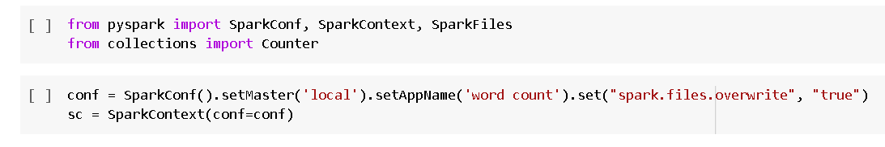
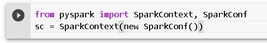
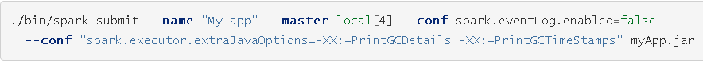
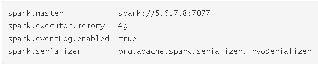

<https://spark.apache.org/docs/latest/configuration.html#spark-properties>

# Spark Properties

- Dynamically Loading Spark Properties
- Viewing Spark Properties
- Available Properties
  - Application Properties
  - Runtime Environment
  - Shuffle Behavior
  - Spark UI
  - Compression and Serialization
  - Memory Management
  - Execution Behavior
  - Executor Metrics
  - Networking
  - Scheduling
  - Barrier Execution Mode
  - Dynamic Allocation
  - Thread Configurations
  - Security
  - Spark SQL
    - Runtime SQL Configuration
    - Static SQL Configuration
  - Spark Streaming
  - SparkR
  - GraphX
  - Deploy
  - Cluster Managers
    - YARN
    - Mesos
    - Kubernetes
    - Standalone Mode

Spark properties kiểm soát hầu hết các cài đặt ứng dụng và được cấu hình riêng cho từng ứng dụng. Các thuộc tính này có thể được đặt trực tiếp trên SparkConf và chuyển tới SparkContext. SparkConf cho phép cấu hình một số thuộc tính phổ biến (ví dụ: URL chính và tên ứng dụng), cũng như các cặp khóa-giá trị tùy ý thông qua phương thức set().

Ví dụ:

# Dynamic Loading Spark Properties

Trong một số trường hợp  muốn tránh mã hóa cứng các cấu hình nhất định trong SparkConf. Ví dụ: muốn chạy cùng một ứng dụng với các bản chính khác nhau hoặc số lượng bộ nhớ khác nhau. Spark cho phép chỉ cần tạo một conf trống:

Sau đó có thể cung cấp các giá trị cấu hình trong runtime:

Spark shell và spark-submit tool hỗ trợ hai cách để tải cấu hình động. Đầu tiên là các tùy chọn dòng lệnh, chẳng hạn như --master, như hình trên. spark-submit có thể chấp nhận bất kỳ thuộc tính Spark nào sử dụng cờ --conf / -c, nhưng sử dụng cờ đặc biệt cho các thuộc tính đóng một vai trò trong việc khởi chạy ứng dụng Spark. Chạy ./bin/spark-submit --help sẽ hiển thị toàn bộ danh sách các tùy chọn.

bin / spark-submit cũng sẽ đọc các tùy chọn cấu hình từ conf / spark-defaults.conf, trong đó mỗi dòng bao gồm một khóa và một giá trị được phân tách bằng khoảng trắng. Ví dụ:

Mọi giá trị được chỉ định dưới dạng cờ hoặc trong tệp thuộc tính sẽ được chuyển đến ứng dụng và được hợp nhất với những giá trị được chỉ định thông qua SparkConf. Các thuộc tính được đặt trực tiếp trên SparkConf được ưu tiên cao nhất, sau đó các cờ được chuyển đến spark-submit hoặc spark-shell, sau đó là các tùy chọn trong tệp spark-defaults.conf.

Spark properties chủ yếu có thể được chia thành hai loại: một là liên quan đến triển khai, như “spark.driver.memory”, “spark.executor.instances”, loại thuộc tính này có thể không bị ảnh hưởng khi thiết lập lập trình thông qua SparkConf trong thời gian chạy, hoặc hành vi tùy thuộc vào trình quản lý cụm và chế độ triển khai đã chọn, vì vậy nên đặt thông qua tệp cấu hình hoặc tùy chọn dòng lệnh spark-submit; một loại khác chủ yếu liên quan đến kiểm soát thời gian chạy Spark, như “spark.task.maxFailures”, loại thuộc tính này có thể được đặt theo một trong hai cách.

# Viewing Spark Properties

Giao diện người dùng web ứng dụng tại http: // <driver>: 4040 liệt kê các thuộc tính Spark trong tab "Environment". Đây là một nơi hữu ích để kiểm tra để đảm bảo rằng các thuộc tính đã được đặt chính xác. Lưu ý rằng chỉ các giá trị được chỉ định rõ ràng thông qua spark-defaults.conf, SparkConf hoặc dòng lệnh mới xuất hiện. Đối với tất cả các thuộc tính cấu hình khác có thể giả sử giá trị mặc định được sử dụng.

# Available Properties

Hầu hết các thuộc tính kiểm soát cài đặt nội bộ đều có giá trị mặc định hợp lý. Một số tùy chọn phổ biến nhất để đặt là:
###
### **Application Properties**
###
|**Tên tài sản**|**Mặc định**|**Ý nghĩa**|**Kể từ phiên bản**|
| :- | :- | :- | :- |
|spark.app.name|(none)|Tên ứng dụng, sẽ xuất hiện trong giao diện người dùng và trong dữ liệu nhật ký.|0.9.0|
|spark.driver.cores|1|Số lõi để sử dụng cho quy trình trình điều khiển, chỉ ở chế độ cụm.|1.3.0|
|spark.driver.maxResultSize|1g|Giới hạn tổng kích thước của các kết quả được tuần tự hóa của tất cả các phân vùng cho mỗi hành động Spark (ví dụ: thu thập) tính bằng byte. Tối thiểu phải là 1M hoặc 0 cho không giới hạn. Công việc sẽ bị hủy bỏ nếu tổng kích thước vượt quá giới hạn này. Có giới hạn cao có thể gây ra lỗi hết bộ nhớ trong trình điều khiển (phụ thuộc vào spark.driver.memory và chi phí bộ nhớ của các đối tượng trong JVM). Đặt giới hạn thích hợp có thể bảo vệ trình điều khiển khỏi lỗi hết bộ nhớ.|1.2.0|
|spark.driver.memory|1g|
Dung lượng bộ nhớ sẽ sử dụng cho quá trình trình điều khiển, tức là nơi SparkContext được khởi tạo, có định dạng giống như chuỗi bộ nhớ JVM với hậu tố đơn vị kích thước ("k", "m", "g" hoặc "t") (ví dụ: 512m, 2g).

Lưu ý: Ở chế độ máy khách, cấu hình này không được đặt thông qua SparkConf trực tiếp trong ứng dụng, vì trình điều khiển JVM đã bắt đầu tại thời điểm đó. Thay vào đó, hãy đặt điều này thông qua tùy chọn dòng lệnh --driver-memory hoặc trong tệp thuộc tính mặc định.
|1.1.1|
|spark.driver.memoryOverhead|driverMemory \* 0.10, with minimum of 384|Số lượng bộ nhớ không heap sẽ được phân bổ cho mỗi quá trình trình điều khiển ở chế độ cụm, trong MiB trừ khi được chỉ định khác. Đây là bộ nhớ chiếm những thứ như tổng chi phí VM, chuỗi được thực hiện, các chi phí chung khác, v.v. Điều này có xu hướng phát triển theo kích thước vùng chứa (thường là 6-10%). Tùy chọn này hiện được hỗ trợ trên YARN, Mesos và Kubernetes. Lưu ý: Bộ nhớ không heap bao gồm bộ nhớ off-heap (khi spark.memory.offHeap.enabled = true) và bộ nhớ được sử dụng bởi các quy trình trình điều khiển khác (ví dụ: quy trình python đi với trình điều khiển PySpark) và bộ nhớ được sử dụng bởi các quy trình không phải trình điều khiển khác chạy trong cùng một container. Kích thước bộ nhớ tối đa của vùng chứa đến trình điều khiển đang chạy được xác định bằng tổng của spark.driver.memoryOverhead và spark.driver.memory.|2.3.0|
|spark.driver.resource.{resourceName}.amount|0|Số lượng của một loại tài nguyên cụ thể để sử dụng trên trình điều khiển. Nếu điều này được sử dụng, phải chỉ định spark.driver.resource. {ResourceName} .discoveryScript để trình điều khiển tìm tài nguyên khi khởi động.|3.0.0|
|spark.driver.resource.{resourceName}.discoveryScript|None|Tập lệnh cho trình điều khiển chạy để khám phá một loại tài nguyên cụ thể. Điều này sẽ ghi vào STDOUT một chuỗi JSON ở định dạng của lớp ResourceInformation. Điều này có một tên và một mảng địa chỉ. Đối với trình điều khiển do khách hàng gửi, tập lệnh khám phá phải gán các địa chỉ tài nguyên khác nhau cho trình điều khiển này so với các trình điều khiển khác trên cùng một máy chủ.|3.0.0|
|spark.driver.resource.{resourceName}.vendor|None|Nhà cung cấp tài nguyên để sử dụng cho trình điều khiển. Tùy chọn này hiện chỉ được hỗ trợ trên Kubernetes và thực tế là cả nhà cung cấp và miền tuân theo quy ước đặt tên plugin thiết bị Kubernetes. (ví dụ: Đối với GPU trên Kubernetes, cấu hình này sẽ được đặt thành nvidia.com hoặc amd.com)|3.0.0|
|spark.resources.discoveryPlugin|org.apache.spark.resource.ResourceDiscoveryScriptPlugin|Danh sách tên lớp được phân tách bằng dấu phẩy triển khai org.apache.spark.api.resource.ResourceDiscoveryPlugin để tải vào ứng dụng. Điều này dành cho người dùng nâng cao để thay thế lớp khám phá tài nguyên bằng một triển khai tùy chỉnh. Spark sẽ thử từng lớp được chỉ định cho đến khi một trong số chúng trả về thông tin tài nguyên cho tài nguyên đó. Nó sẽ thử tập lệnh khám phá lần cuối nếu không có plugin nào trả lại thông tin cho tài nguyên đó.|3.0.0|
|spark.executor.memory|1g|Dung lượng bộ nhớ sẽ sử dụng cho mỗi quá trình thực thi, có cùng định dạng với chuỗi bộ nhớ JVM với hậu tố đơn vị kích thước ("k", "m", "g" hoặc "t") (ví dụ: 512m, 2g).|0.7.0|
|spark.executor.pyspark.memory|Not set|
Lượng bộ nhớ được cấp phát cho PySpark trong mỗi trình thực thi, trong MiB trừ khi được chỉ định khác. Nếu được đặt, bộ nhớ PySpark cho một trình thực thi sẽ bị giới hạn ở số lượng này. Nếu không được thiết lập, Spark sẽ không giới hạn việc sử dụng bộ nhớ của Python và tùy thuộc vào ứng dụng để tránh vượt quá không gian bộ nhớ trên cao được chia sẻ với các quy trình không phải JVM khác. Khi PySpark được chạy trong YARN hoặc Kubernetes, bộ nhớ này được thêm vào các yêu cầu tài nguyên của trình thực thi.

Lưu ý: Tính năng này phụ thuộc vào mô-đun `resource` của Python; do đó, các hành vi và hạn chế được kế thừa. Ví dụ: Windows không hỗ trợ giới hạn tài nguyên và tài nguyên thực tế không bị giới hạn trên MacOS.
|2.4.0|
|spark.executor.memoryOverhead|executorMemory \* 0.10, with minimum of 384|
Lượng bộ nhớ bổ sung sẽ được cấp phát cho mỗi quá trình thực thi ở chế độ cụm, trong MiB trừ khi được chỉ định khác. Đây là bộ nhớ chiếm những thứ như tổng chi phí VM, chuỗi được thực hiện, các tổng chi phí gốc khác, v.v. Điều này có xu hướng phát triển theo kích thước trình thực thi (thường là 6-10%). Tùy chọn này hiện được hỗ trợ trên YARN và Kubernetes.

Lưu ý: Bộ nhớ bổ sung bao gồm bộ nhớ người thực thi PySpark (khi spark.executor.pyspark.memory không được định cấu hình) và bộ nhớ được sử dụng bởi các quá trình không phải người thực thi khác đang chạy trong cùng một vùng chứa. Kích thước bộ nhớ tối đa của vùng chứa đến trình thực thi đang chạy được xác định bằng tổng của spark.executor.memoryOverhead, spark.executor.memory, spark.memory.offHeap.size và spark.executor.pyspark.memory.
|2.3.0|
|spark.executor.resource.{resourceName}.amount|0|Số lượng của một loại tài nguyên cụ thể để sử dụng cho mỗi quá trình thực thi. Nếu điều này được sử dụng, phải chỉ định spark.executor.resource. {ResourceName} .discoveryScript để trình thực thi tìm tài nguyên khi khởi động.|3.0.0|
|spark.executor.resource.{resourceName}.discoveryScript|None|Một tập lệnh để trình thực thi chạy để khám phá một loại tài nguyên cụ thể. Điều này sẽ ghi vào STDOUT một chuỗi JSON ở định dạng của lớp ResourceInformation. Điều này có một tên và một mảng địa chỉ.|3.0.0|
|spark.executor.resource.{resourceName}.vendor|None|Nhà cung cấp tài nguyên để sử dụng cho những người thực thi. Tùy chọn này hiện chỉ được hỗ trợ trên Kubernetes và thực tế là cả nhà cung cấp và miền tuân theo quy ước đặt tên plugin thiết bị Kubernetes. (ví dụ: Đối với GPU trên Kubernetes, cấu hình này sẽ được đặt thành nvidia.com hoặc amd.com)|3.0.0|
|spark.extraListeners|(none)|Danh sách các lớp được phân tách bằng dấu phẩy triển khai SparkListener; khi khởi tạo SparkContext, các cá thể của các lớp này sẽ được tạo và đăng ký với bus lắng nghe của Spark. Nếu một lớp có một phương thức khởi tạo một đối số chấp nhận một SparkConf, thì phương thức khởi tạo đó sẽ được gọi; nếu không, một hàm tạo không đối số sẽ được gọi. Nếu không tìm thấy hàm tạo hợp lệ nào, quá trình tạo SparkContext sẽ không thành công với một ngoại lệ.|1.3.0|
|spark.local.dir|/tmp|
Thư mục để sử dụng cho không gian "scratch" trong Spark, bao gồm các tệp đầu ra bản đồ và RDD được lưu trữ trên đĩa. Điều này phải nằm trên một đĩa cục bộ trong hệ thống. Nó cũng có thể là một danh sách được phân tách bằng dấu phẩy gồm nhiều thư mục trên các đĩa khác nhau.

Lưu ý: Điều này sẽ bị ghi đè bởi các biến môi trường SPARK\_LOCAL\_DIRS (Standalone), MESOS\_SANDBOX (Mesos) hoặc LOCAL\_DIRS (YARN) do người quản lý cụm thiết lập.
|0.5.0|
|spark.logConf|false|Ghi lại SparkConf hiệu quả dưới dạng INFO khi SparkContext được khởi động.|0.9.0|
|spark.master|(none)|Người quản lý cụm để kết nối. Xem danh sách các URL chính được phép.|0.9.0|
|spark.submit.deployMode|(none)|Chế độ triển khai của chương trình trình điều khiển Spark, "client" hoặc "cluster", có nghĩa là khởi chạy chương trình trình điều khiển cục bộ ("client ") hoặc từ xa ("cluster") trên một trong các nút bên trong cụm.|1.5.0|
|spark.log.callerContext|(none)|Thông tin ứng dụng sẽ được ghi vào nhật ký Yarn RM / nhật ký kiểm tra HDFS khi chạy trên Yarn / HDFS. Độ dài của nó phụ thuộc vào cấu hình Hadoop hadoop.caller.context.max.size. Nó phải ngắn gọn và thường có thể có tối đa 50 ký tự.|2.2.0|
|spark.driver.supervise|false|Nếu đúng, hãy tự động khởi động lại trình điều khiển nếu nó không thành công với trạng thái thoát khác không. Chỉ có hiệu lực trong chế độ độc lập Spark hoặc chế độ triển khai cụm Mesos.|1.3.0|
|spark.driver.log.dfsDir|(none)|Thư mục cơ sở chứa nhật ký trình điều khiển Spark được đồng bộ hóa, nếu spark.driver.log.persistToDfs.enabled là true. Trong thư mục cơ sở này, mỗi ứng dụng ghi nhật ký trình điều khiển vào một tệp ứng dụng cụ thể. Người dùng có thể muốn đặt vị trí này thành một vị trí thống nhất như thư mục HDFS để các tệp nhật ký trình điều khiển có thể được duy trì để sử dụng sau này. Thư mục này sẽ cho phép mọi người dùng Spark đọc / ghi tệp và người dùng Spark History Server xóa tệp. Ngoài ra, các nhật ký cũ hơn từ thư mục này sẽ được Máy chủ Lịch sử Spark làm sạch nếu spark.history.fs.driverlog.cleaner.enabled là đúng và nếu chúng cũ hơn tuổi tối đa được định cấu hình bằng cách đặt spark.history.fs.driverlog.cleaner. maxAge.|3.0.0|
|spark.driver.log.persistToDfs.enabled|false|Nếu đúng, ứng dụng spark đang chạy ở chế độ máy khách sẽ ghi nhật ký trình điều khiển vào kho lưu trữ liên tục, được định cấu hình trong spark.driver.log.dfsDir. Nếu spark.driver.log.dfsDir không được định cấu hình, nhật ký trình điều khiển sẽ không được lưu giữ. Ngoài ra, hãy bật trình dọn dẹp bằng cách đặt spark.history.fs.driverlog.cleaner.enabled thành true trong Spark History Server.|3.0.0|
|spark.driver.log.layout|%d{yy/MM/dd HH:mm:ss.SSS} %t %p %c{1}: %m%n|Bố cục cho nhật ký trình điều khiển được đồng bộ hóa với spark.driver.log.dfsDir. Nếu điều này không được định cấu hình, nó sẽ sử dụng bố cục cho appender đầu tiên được xác định trong log4j.properties. Nếu điều đó cũng không được định cấu hình, nhật ký trình điều khiển sử dụng bố cục mặc định.|3.0.0|
|spark.driver.log.allowErasureCoding|false|Có cho phép nhật ký trình điều khiển sử dụng mã xóa hay không. Trên HDFS, các tệp được mã hóa xóa sẽ không cập nhật nhanh chóng như các tệp được sao chép thông thường, do đó, chúng mất nhiều thời gian hơn để phản ánh các thay đổi do ứng dụng viết. Lưu ý rằng ngay cả khi điều này là đúng, Spark vẫn sẽ không buộc tệp sử dụng mã hóa xóa, nó sẽ chỉ sử dụng mặc định của hệ thống tệp.|3.0.0|

###
### **Runtime Environment**
###

|**Tên tài sản**|**Mặc định**|**Ý nghĩa**|**Kể từ phiên bản**|
| :- | :- | :- | :- |
|spark.driver.extraClassPath|(không ai)|Các mục nhập classpath bổ sung để thêm trước vào classpath của trình điều khiển. *Lưu ý:* Trong chế độ máy khách, cấu hình này không được đặt thông qua SparkConf trực tiếp trong ứng dụng của bạn, vì trình điều khiển JVM đã bắt đầu tại thời điểm đó. Thay vào đó, hãy đặt điều này thông qua --driver-class-pathtùy chọn dòng lệnh hoặc trong tệp thuộc tính mặc định của bạn.|1.0.0|
|spark.driver.defaultJavaOptions|(không ai)|Một chuỗi các tùy chọn JVM mặc định để thêm vào spark.driver.extraJavaOptions. Điều này được thiết lập bởi các quản trị viên. Ví dụ: cài đặt GC hoặc ghi nhật ký khác. Lưu ý rằng việc đặt cài đặt kích thước heap tối đa (-Xmx) với tùy chọn này là bất hợp pháp. Cài đặt kích thước đống tối đa có thể được đặt spark.driver.memorytrong chế độ cụm và thông qua --driver-memorytùy chọn dòng lệnh trong chế độ máy khách. *Lưu ý:* Trong chế độ máy khách, cấu hình này không được đặt thông qua SparkConf trực tiếp trong ứng dụng của bạn, vì trình điều khiển JVM đã bắt đầu tại thời điểm đó. Thay vào đó, hãy đặt điều này thông qua --driver-java-optionstùy chọn dòng lệnh hoặc trong tệp thuộc tính mặc định của bạn.|3.0.0|
|spark.driver.extraJavaOptions|(không ai)|Một chuỗi các tùy chọn JVM bổ sung để chuyển cho người lái xe. Điều này là do người dùng thiết lập. Ví dụ: cài đặt GC hoặc ghi nhật ký khác. Lưu ý rằng việc đặt cài đặt kích thước heap tối đa (-Xmx) với tùy chọn này là bất hợp pháp. Cài đặt kích thước đống tối đa có thể được đặt spark.driver.memorytrong chế độ cụm và thông qua --driver-memorytùy chọn dòng lệnh trong chế độ máy khách. *Lưu ý:* Trong chế độ máy khách, cấu hình này không được đặt thông qua SparkConf trực tiếp trong ứng dụng của bạn, vì trình điều khiển JVM đã bắt đầu tại thời điểm đó. Thay vào đó, hãy đặt điều này thông qua --driver-java-optionstùy chọn dòng lệnh hoặc trong tệp thuộc tính mặc định của bạn. spark.driver.defaultJavaOptionssẽ được thêm vào cấu hình này.|1.0.0|
|spark.driver.extraLibraryPath|(không ai)|Đặt một đường dẫn thư viện đặc biệt để sử dụng khi khởi chạy trình điều khiển JVM. *Lưu ý:* Trong chế độ máy khách, cấu hình này không được đặt thông qua SparkConf trực tiếp trong ứng dụng của bạn, vì trình điều khiển JVM đã bắt đầu tại thời điểm đó. Thay vào đó, hãy đặt điều này thông qua --driver-library-pathtùy chọn dòng lệnh hoặc trong tệp thuộc tính mặc định của bạn.|1.0.0|
|spark.driver.userClassPathFirst|sai|(Thử nghiệm) Có ưu tiên các lọ do người dùng thêm vào các lọ của chính Spark khi tải các lớp trong trình điều khiển hay không. Tính năng này có thể được sử dụng để giảm thiểu xung đột giữa phụ thuộc của Spark và phụ thuộc của người dùng. Nó hiện là một tính năng thử nghiệm. Điều này chỉ được sử dụng trong chế độ cụm.|1.3.0|
|spark.executor.extraClassPath|(không ai)|Các mục nhập classpath bổ sung để thêm trước vào classpath của những người thực thi. Điều này tồn tại chủ yếu để tương thích ngược với các phiên bản Spark cũ hơn. Người dùng thường không cần đặt tùy chọn này.|1.0.0|
|spark.executor.defaultJavaOptions|(không ai)|Một chuỗi các tùy chọn JVM mặc định để thêm vào spark.executor.extraJavaOptions. Điều này được thiết lập bởi các quản trị viên. Ví dụ: cài đặt GC hoặc ghi nhật ký khác. Lưu ý rằng việc đặt thuộc tính Spark hoặc cài đặt kích thước heap tối đa (-Xmx) với tùy chọn này là bất hợp pháp. Thuộc tính Spark phải được đặt bằng đối tượng SparkConf hoặc tệp spark-defaults.conf được sử dụng với tập lệnh spark-submit. Có thể đặt cài đặt kích thước đống tối đa bằng spark.executor.memory. Các ký hiệu sau, nếu có sẽ được nội suy: sẽ được thay thế bằng ID ứng dụng và sẽ được thay thế bằng ID người thực thi. Ví dụ: để bật tính năng ghi nhật ký gc chi tiết vào tệp có tên cho ID thực thi của ứng dụng trong / tmp, hãy chuyển 'giá trị' là: -verbose:gc -Xloggc:/tmp/-.gc|3.0.0|
|spark.executor.extraJavaOptions|(không ai)|Một chuỗi các tùy chọn JVM bổ sung để chuyển cho người thực thi. Điều này là do người dùng thiết lập. Ví dụ: cài đặt GC hoặc ghi nhật ký khác. Lưu ý rằng việc đặt thuộc tính Spark hoặc cài đặt kích thước heap tối đa (-Xmx) bằng tùy chọn này là bất hợp pháp. Thuộc tính Spark phải được đặt bằng đối tượng SparkConf hoặc tệp spark-defaults.conf được sử dụng với tập lệnh spark-submit. Có thể đặt cài đặt kích thước đống tối đa bằng spark.executor.memory. Các ký hiệu sau, nếu có sẽ được nội suy: sẽ được thay thế bằng ID ứng dụng và sẽ được thay thế bằng ID người thực thi. Ví dụ: để bật tính năng ghi nhật ký gc chi tiết vào tệp được đặt tên cho ID thực thi của ứng dụng trong / tmp, hãy chuyển 'giá trị' là: -verbose:gc -Xloggc:/tmp/-.gc spark.executor.defaultJavaOptionssẽ được thêm vào trước cấu hình này.|1.0.0|
|spark.executor.extraLibraryPath|(không ai)|Đặt một đường dẫn thư viện đặc biệt để sử dụng khi khởi chạy JVM của trình thực thi.|1.0.0|
|spark.executor.logs.rolling.maxRetainedFiles|(không ai)|Đặt số lượng tệp nhật ký luân phiên mới nhất sẽ được hệ thống giữ lại. Các tệp nhật ký cũ hơn sẽ bị xóa. Bị tắt theo mặc định.|1.1.0|
|spark.executor.logs.rolling.enableCompression|sai|Bật nén nhật ký thực thi. Nếu nó được kích hoạt, nhật ký trình thực thi được cuộn sẽ được nén. Bị tắt theo mặc định.|2.0.2|
|spark.executor.logs.rolling.maxSize|(không ai)|Đặt kích thước tối đa của tệp theo byte mà nhật ký trình thực thi sẽ được cuộn qua. Tính năng cuộn bị tắt theo mặc định. Xem spark.executor.logs.rolling.maxRetainedFiles để tự động làm sạch nhật ký cũ.|1.4.0|
|spark.executor.logs.rolling.strategy|(không ai)|Đặt chiến lược cuộn nhật ký của người thực thi. Theo mặc định, nó bị tắt. Nó có thể được đặt thành "time" (lăn theo thời gian) hoặc "size" (lăn dựa trên kích thước). Đối với "thời gian", sử dụng spark.executor.logs.rolling.time.intervalđể đặt khoảng thời gian lăn. Đối với "kích thước", hãy sử dụng spark.executor.logs.rolling.maxSizeđể đặt kích thước tệp tối đa cho cuộn.|1.1.0|
|spark.executor.logs.rolling.time.interval|hằng ngày|Đặt khoảng thời gian mà nhật ký trình thực thi sẽ được cuộn qua. Tính năng cuộn bị tắt theo mặc định. Giá trị hợp lệ là daily, hourly, minutelyhoặc bất kỳ khoảng thời gian trong vài giây. Xem spark.executor.logs.rolling.maxRetainedFiles để tự động làm sạch nhật ký cũ.|1.1.0|
|spark.executor.userClassPathFirst|sai|(Thử nghiệm) Chức năng tương tự spark.driver.userClassPathFirstnhưng được áp dụng cho các phiên bản của trình thực thi.|1.3.0|
|spark.executorEnv.[EnvironmentVariableName]|(không ai)|Thêm biến môi trường được chỉ định bởi EnvironmentVariableNamequy trình Executor. Người dùng có thể chỉ định nhiều trong số này để đặt nhiều biến môi trường.|0,9.0|
|spark.redaction.regex|(? i) bí mật | mật khẩu | mã thông báo|Regex để quyết định các thuộc tính cấu hình Spark và biến môi trường nào trong môi trường trình điều khiển và trình thực thi chứa thông tin nhạy cảm. Khi regex này khớp với khóa hoặc giá trị thuộc tính, giá trị sẽ được biên dịch lại từ giao diện người dùng môi trường và các nhật ký khác nhau như YARN và nhật ký sự kiện.|2.1.2|
|spark.python.profile|sai|Bật cấu hình trong Python worker, kết quả cấu hình sẽ hiển thị trước sc.show\_profiles()hoặc nó sẽ được hiển thị trước khi trình điều khiển thoát. Nó cũng có thể được đổ vào đĩa bằng sc.dump\_profiles(path). Nếu một số kết quả hồ sơ đã được hiển thị theo cách thủ công, chúng sẽ không được hiển thị tự động trước khi người lái xe thoát ra. Theo mặc định, pyspark.profiler.BasicProfilersẽ được sử dụng, nhưng điều này có thể bị ghi đè bằng cách chuyển một lớp hồ sơ làm tham số cho hàm SparkContexttạo.|1.2.0|
|spark.python.profile.dump|(không ai)|Thư mục được sử dụng để kết xuất kết quả hồ sơ trước khi trình điều khiển thoát. Kết quả sẽ được kết xuất dưới dạng tệp riêng biệt cho từng RDD. Chúng có thể được tải bằng pstats.Stats(). Nếu điều này được chỉ định, kết quả hồ sơ sẽ không được hiển thị tự động.|1.2.0|
|spark.python.worker.memory|512m|Dung lượng bộ nhớ sử dụng cho mỗi quá trình lao động python trong tập hợp, trong định dạng giống như chuỗi ký ức JVM với một đơn vị kích thước hậu tố ( "k", "m", "g" hoặc "t") (ví dụ 512m, 2g). Nếu bộ nhớ được sử dụng trong quá trình tổng hợp vượt quá dung lượng này, nó sẽ tràn dữ liệu vào đĩa.|1.1.0|
|spark.python.worker.reuse|thật|Sử dụng lại công nhân Python hay không. Nếu có, nó sẽ sử dụng một số lượng nhân viên Python cố định, không cần fork () một quy trình Python cho mọi tác vụ. Nó sẽ rất hữu ích nếu có một chương trình phát sóng lớn, khi đó chương trình phát sóng sẽ không cần phải chuyển từ JVM sang Python worker cho mọi tác vụ.|1.2.0|
|spark.files||Danh sách tệp được phân tách bằng dấu phẩy sẽ được đặt trong thư mục làm việc của mỗi trình thực thi. Quả cầu được cho phép.|1.0.0|
|spark.submit.pyFiles||Danh sách các tệp .zip, .egg hoặc .py được phân tách bằng dấu phẩy để đặt trên ứng dụng PYTHONPATH cho Python. Quả cầu được cho phép.|1.0.1|
|spark.jars||Danh sách các lọ được phân tách bằng dấu phẩy để bao gồm trên classpath của trình điều khiển và trình thực thi. Quả cầu được cho phép.|0,9.0|
|spark.jars.packages||Danh sách được phân tách bằng dấu phẩy gồm các tọa độ Maven của các chum để đưa vào các đường dẫn của trình điều khiển và trình thực thi. Các tọa độ phải là groupId: artistId: version. Nếu spark.jars.ivySettings được cung cấp, phần tạo tác sẽ được giải quyết theo cấu hình trong tệp, nếu không, phần tạo tác sẽ được tìm kiếm trong kho maven cục bộ, sau đó là trung tâm maven và cuối cùng là bất kỳ kho lưu trữ từ xa bổ sung nào được cung cấp bởi tùy chọn dòng lệnh --repositories. Để biết thêm chi tiết, hãy xem [Quản lý phụ thuộc nâng cao](https://spark.apache.org/docs/latest/submitting-applications.html#advanced-dependency-management) .|1.5.0|
|spark.jars.excludes||Danh sách được phân tách bằng dấu phẩy của groupId: ArtiId, để loại trừ trong khi giải quyết các phần phụ thuộc được cung cấp spark.jars.packagesđể tránh xung đột phụ thuộc.|1.5.0|
|spark.jars.ivy||Đường dẫn để chỉ định thư mục người dùng Ivy, được sử dụng cho bộ nhớ cache Ivy cục bộ và các tệp gói từ spark.jars.packages. Điều này sẽ ghi đè thuộc tính Ivy ivy.default.ivy.user.dir mặc định là ~ / .ivy2.|1.3.0|
|spark.jars.ivySettings||Đường dẫn đến tệp cài đặt Ivy để tùy chỉnh độ phân giải của các lọ được chỉ định bằng cách sử dụng spark.jars.packages thay vì các mặc định tích hợp, chẳng hạn như trung tâm maven. Các kho lưu trữ bổ sung được cung cấp bởi tùy chọn dòng lệnh --repositorieshoặc spark.jars.repositoriescũng sẽ được bao gồm. Hữu ích khi cho phép Spark giải quyết các hiện vật từ phía sau tường lửa, ví dụ thông qua máy chủ tạo tác nội bộ như Artifactory. Bạn có thể tìm thấy chi tiết về định dạng tệp cài đặt tại [Tệp Cài đặt](http://ant.apache.org/ivy/history/latest-milestone/settings.html)|2.2.0|
|spark.jars.repositories||Danh sách các kho lưu trữ từ xa bổ sung được phân tách bằng dấu phẩy để tìm kiếm các tọa độ maven được cung cấp với --packageshoặc spark.jars.packages.|2.3.0|
|spark.pyspark.driver.python||Thực thi nhị phân Python để sử dụng cho PySpark trong trình điều khiển. (mặc định là spark.pyspark.python)|2.1.0|
|spark.pyspark.python||Thực thi nhị phân Python để sử dụng cho PySpark trong cả trình điều khiển và trình thực thi.|2.1.0|
###
### **Shuffle Behavior**
###
|**Tên tài sản**|**Mặc định**|**Ý nghĩa**|**Kể từ phiên bản**|
| :- | :- | :- | :- |
|spark.reducer.maxSizeInFlight|48m|Kích thước tối đa của đầu ra bản đồ để tìm nạp đồng thời từ mỗi tác vụ giảm, trong MiB trừ khi được chỉ định khác. Vì mỗi đầu ra yêu cầu chúng ta tạo một bộ đệm để nhận nó, điều này đại diện cho chi phí bộ nhớ cố định cho mỗi tác vụ giảm, vì vậy hãy giữ nó nhỏ trừ khi bạn có một lượng lớn bộ nhớ.|1.4.0|
|spark.reducer.maxReqsInFlight|Int.MaxValue|Cấu hình này giới hạn số lượng yêu cầu từ xa để tìm nạp các khối tại bất kỳ điểm nhất định nào. Khi số lượng máy chủ trong cụm tăng lên, nó có thể dẫn đến số lượng rất lớn các kết nối gửi đến một hoặc nhiều nút, khiến các công nhân bị lỗi khi tải. Bằng cách cho phép nó giới hạn số lượng yêu cầu tìm nạp, tình huống này có thể được giảm thiểu.|2.0.0|
|spark.reducer.maxBlocksInFlightPerAddress|Int.MaxValue|Cấu hình này giới hạn số lượng khối từ xa được tìm nạp cho mỗi tác vụ giảm từ một cổng máy chủ nhất định. Khi một số lượng lớn các khối đang được yêu cầu từ một địa chỉ nhất định trong một lần tìm nạp hoặc đồng thời, điều này có thể làm hỏng trình thực thi phục vụ hoặc Trình quản lý nút. Điều này đặc biệt hữu ích để giảm tải trên Node Manager khi bật chế độ trộn bên ngoài. Bạn có thể giảm thiểu vấn đề này bằng cách đặt nó thành một giá trị thấp hơn.|2.2.1|
|spark.shuffle.compress|true|Có nén các tệp đầu ra bản đồ hay không. Nói chung là một ý kiến ​​hay. Nén sẽ sử dụng spark.io.compression.codec.|0.6.0|
|spark.shuffle.file.buffer|32k|Kích thước của bộ đệm trong bộ nhớ cho mỗi luồng đầu ra tệp trộn, trong KiB trừ khi được chỉ định khác. Các bộ đệm này làm giảm số lần tìm đĩa và các lệnh gọi hệ thống được thực hiện trong việc tạo các tệp ngẫu nhiên trung gian.|1.4.0|
|spark.shuffle.io.maxRetries|3|(Chỉ Netty) Các lần tìm nạp không thành công do các ngoại lệ liên quan đến IO sẽ tự động được thử lại nếu giá trị này được đặt thành giá trị khác 0. Logic thử lại này giúp ổn định các xáo trộn lớn khi đối mặt với các thời gian tạm dừng GC kéo dài hoặc các sự cố kết nối mạng tạm thời.|1.2.0|
|spark.shuffle.io.numConnectionsPerPeer|1|(Chỉ mạng) Kết nối giữa các máy chủ được sử dụng lại để giảm tích tụ kết nối cho các cụm lớn. Đối với các cụm có nhiều đĩa cứng và ít máy chủ, điều này có thể dẫn đến không đủ đồng thời để bão hòa tất cả các đĩa và do đó người dùng có thể cân nhắc việc tăng giá trị này.|1.2.1|
|spark.shuffle.io.preferDirectBufs|true|(Chỉ Netty) Bộ đệm off-heap được sử dụng để giảm việc thu gom rác trong quá trình phát ngẫu nhiên và chuyển khối bộ nhớ cache. Đối với các môi trường mà bộ nhớ off-heap bị giới hạn chặt chẽ, người dùng có thể muốn tắt tính năng này để buộc tất cả các phân bổ từ Netty ở chế độ on-heap.|1.2.0|
|spark.shuffle.io.retryWait|5s|(Chỉ mạng) Thời gian chờ giữa các lần tìm nạp lại. Độ trễ tối đa do thử lại là 15 giây theo mặc định, được tính bằng maxRetries \* retryWait.|1.2.1|
|spark.shuffle.io.backLog|-1|Độ dài của hàng đợi chấp nhận cho dịch vụ trộn. Đối với các ứng dụng lớn, giá trị này có thể cần được tăng lên để các kết nối đến không bị giảm nếu dịch vụ không thể theo kịp với số lượng lớn các kết nối đến trong một khoảng thời gian ngắn. Điều này cần được định cấu hình ở bất kỳ nơi nào mà bản thân dịch vụ trộn bài đang chạy, có thể nằm ngoài ứng dụng (xem spark.shuffle.service.enabledtùy chọn bên dưới). Nếu được đặt dưới 1, sẽ trở về mặc định của HĐH do Netty's xác định io.netty.util.NetUtil#SOMAXCONN.|1.1.1|
|spark.shuffle.service.enabled|false|Bật dịch vụ trộn bên ngoài. Dịch vụ này lưu giữ các tệp xáo trộn được viết bởi những người thực thi để những người thực thi có thể được xóa một cách an toàn. Điều này phải được bật nếu spark.dynamicAllocation.enabledlà "true". Dịch vụ trộn bên ngoài phải được thiết lập để kích hoạt nó. Xem [cấu hình phân bổ động và tài liệu thiết lập](https://spark.apache.org/docs/latest/job-scheduling.html#configuration-and-setup) để biết thêm thông tin.|1.2.0|
|spark.shuffle.service.port|7337|Cổng mà dịch vụ trộn bên ngoài sẽ chạy.|1.2.0|
|spark.shuffle.service.index.cache.size|100m|Các mục nhập trong bộ nhớ cache được giới hạn trong vùng nhớ được chỉ định, tính bằng byte trừ khi được chỉ định khác.|2.3.0|
|spark.shuffle.maxChunksBeingTransferred|Long.MAX\_VALUE|Số lượng khối tối đa được phép chuyển cùng một lúc trên dịch vụ trộn bài. Lưu ý rằng các kết nối mới sẽ bị đóng khi đạt đến số lượng tối đa. Máy khách sẽ thử lại theo cấu hình trộn lại thử (xem spark.shuffle.io.maxRetriesvà spark.shuffle.io.retryWait), nếu đạt đến các giới hạn đó, tác vụ sẽ không thành công với lỗi tìm nạp.|2.3.0|
|spark.shuffle.sort.bypassMergeThreshold|200|(Nâng cao) Trong trình quản lý xáo trộn dựa trên sắp xếp, tránh sắp xếp dữ liệu hợp nhất nếu không có tổng hợp phía bản đồ và có nhiều nhất là nhiều phân vùng giảm.|1.1.1|
|spark.shuffle.spill.compress|true|Có nén dữ liệu bị tràn trong quá trình xáo trộn hay không. Nén sẽ sử dụng spark.io.compression.codec.|0.9.0|
|spark.shuffle.accurateBlockThreshold|100 \* 1024 \* 1024|Ngưỡng tính bằng byte trên đó ghi lại chính xác kích thước của khối xáo trộn trong HighlyCompressedMapStatus. Điều này giúp ngăn chặn OOM bằng cách tránh đánh giá thấp kích thước khối trộn khi tìm nạp khối trộn.|2.2.1|
|spark.shuffle.registration.timeout|5000|Thời gian chờ tính bằng mili giây để đăng ký dịch vụ trộn bên ngoài.|2.3.0|
|spark.shuffle.registration.maxAttempts|3|Khi chúng tôi không đăng ký được dịch vụ xáo trộn bên ngoài, chúng tôi sẽ thử lại trong thời gian maxAttempts.|2.3.0|
###
### **Giao diện ng dùng spark**
###
|**Tên tài sản**|**Mặc định**|**Ý nghĩa**|**Kể từ phiên bản**|
| :- | :- | :- | :- |
|spark.eventLog.logBlockUpdates.enabled|sai|Có ghi lại các sự kiện cho mỗi lần cập nhật khối hay không, nếu spark.eventLog.enabledđúng. \* Cảnh báo \*: Điều này sẽ làm tăng đáng kể kích thước của nhật ký sự kiện.|2.3.0|
|spark.eventLog.longForm.enabled|sai|Nếu đúng, hãy sử dụng biểu mẫu dài của các trang web cuộc gọi trong nhật ký sự kiện. Nếu không, hãy sử dụng mẫu ngắn.|2.4.0|
|spark.eventLog.compress|sai|Có nén các sự kiện đã ghi, nếu spark.eventLog.enabledđúng.|1.0.0|
|spark.eventLog.compression.codec||Codec để nén các sự kiện đã ghi. Nếu điều này không được đưa ra, spark.io.compression.codecsẽ được sử dụng.|3.0.0|
|spark.eventLog.erasureCoding.enabled|sai|Cho phép nhật ký sự kiện sử dụng mã hóa xóa hay tắt mã hóa xóa, bất kể giá trị mặc định của hệ thống tệp. Trên HDFS, các tệp được mã hóa xóa sẽ không cập nhật nhanh như các tệp sao chép thông thường, do đó, các bản cập nhật ứng dụng sẽ mất nhiều thời gian hơn để xuất hiện trong Máy chủ Lịch sử. Lưu ý rằng ngay cả khi điều này là đúng, Spark vẫn sẽ không buộc tệp sử dụng mã hóa xóa, nó sẽ chỉ sử dụng mặc định của hệ thống tệp.|3.0.0|
|spark.eventLog.dir|tệp: /// tmp / spark-sự kiện|Thư mục cơ sở trong đó các sự kiện Spark được ghi lại, nếu spark.eventLog.enabledđúng. Trong thư mục cơ sở này, Spark tạo một thư mục con cho mỗi ứng dụng và ghi nhật ký các sự kiện cụ thể cho ứng dụng trong thư mục này. Người dùng có thể muốn đặt vị trí này thành một vị trí thống nhất như thư mục HDFS để máy chủ lịch sử có thể đọc các tệp lịch sử.|1.0.0|
|spark.eventLog.enabled|sai|Có ghi lại các sự kiện Spark hay không, hữu ích cho việc tạo lại giao diện người dùng Web sau khi ứng dụng hoàn tất.|1.0.0|
|spark.eventLog.overwrite|sai|Có ghi đè lên bất kỳ tệp hiện có nào không.|1.0.0|
|spark.eventLog.buffer.kb|100k|Kích thước bộ đệm để sử dụng khi ghi vào các luồng đầu ra, trong KiB trừ khi được chỉ định khác.|1.0.0|
|spark.eventLog.rolling.enabled|sai|Việc cuộn qua các tệp nhật ký sự kiện có được bật hay không. Nếu được đặt thành true, nó sẽ cắt từng tệp nhật ký sự kiện xuống kích thước đã định cấu hình.|3.0.0|
|spark.eventLog.rolling.maxFileSize|128m|Khi nào spark.eventLog.rolling.enabled=true, chỉ định kích thước tối đa của tệp nhật ký sự kiện trước khi cuộn qua.|3.0.0|
|spark.ui.dagGraph.retainedRootRDDs|Int.MaxValue|Có bao nhiêu nút đồ thị DAG mà giao diện người dùng Spark và API trạng thái nhớ trước khi thu gom rác.|2.1.0|
|spark.ui.enabled|thật|Có chạy giao diện người dùng web cho ứng dụng Spark hay không.|1.1.1|
|spark.ui.killEnabled|thật|Cho phép loại bỏ các công việc và giai đoạn khỏi giao diện người dùng web.|1.0.0|
|spark.ui.liveUpdate.period|100ms|Tần suất cập nhật các thực thể trực tiếp. -1 có nghĩa là "không bao giờ cập nhật" khi phát lại ứng dụng, nghĩa là chỉ lần ghi cuối cùng sẽ xảy ra. Đối với các ứng dụng trực tiếp, điều này tránh một số thao tác mà chúng ta có thể sống mà không có khi xử lý nhanh các sự kiện tác vụ đến.|2.3.0|
|spark.ui.liveUpdate.minFlushPeriod|1 giây|Thời gian tối thiểu trôi qua trước khi dữ liệu UI cũ được xóa. Điều này giúp tránh sự trì trệ của giao diện người dùng khi các sự kiện tác vụ đến không được kích hoạt thường xuyên.|2.4.2|
|spark.ui.port|4040|Cổng cho bảng điều khiển của ứng dụng của bạn, nơi hiển thị dữ liệu bộ nhớ và khối lượng công việc.|0,7,0|
|spark.ui.retainedJobs|1000|Giao diện người dùng Spark và API trạng thái ghi nhớ bao nhiêu công việc trước khi thu gom rác. Đây là mức tối đa mục tiêu và có thể giữ lại ít phần tử hơn trong một số trường hợp.|1.2.0|
|spark.ui.retainedStages|1000|Giao diện người dùng Spark và API trạng thái ghi nhớ bao nhiêu giai đoạn trước khi thu gom rác. Đây là mức tối đa mục tiêu và có thể giữ lại ít phần tử hơn trong một số trường hợp.|0,9.0|
|spark.ui.retainedTasks|100000|Có bao nhiêu tác vụ trong một giai đoạn mà giao diện người dùng Spark và các API trạng thái ghi nhớ trước khi thu gom rác. Đây là mức tối đa mục tiêu và có thể giữ lại ít phần tử hơn trong một số trường hợp.|2.0.1|
|spark.ui.reverseProxy|sai|Cho phép chạy Spark Master làm proxy ngược cho giao diện người dùng ứng dụng và công nhân. Trong chế độ này, Spark master sẽ đảo ngược proxy của giao diện người dùng ứng dụng và công nhân để cho phép truy cập mà không yêu cầu quyền truy cập trực tiếp vào máy chủ của họ. Hãy sử dụng nó một cách thận trọng, vì giao diện người dùng của ứng dụng và công nhân sẽ không thể truy cập trực tiếp, bạn sẽ chỉ có thể truy cập chúng thông qua URL công khai chính / proxy spark. Cài đặt này ảnh hưởng đến tất cả công nhân và giao diện người dùng ứng dụng đang chạy trong cụm và phải được đặt trên tất cả công nhân, trình điều khiển và chủ.|2.1.0|
|spark.ui.reverseProxyUrl||Đây là URL nơi proxy của bạn đang chạy. URL này dành cho proxy đang chạy trước Spark Master. Điều này rất hữu ích khi chạy proxy để xác thực, ví dụ như proxy OAuth. Đảm bảo rằng đây là một URL hoàn chỉnh bao gồm lược đồ (http / https) và cổng để truy cập proxy của bạn.|2.1.0|
|spark.ui.proxyRedirectUri||Nơi giải quyết các chuyển hướng khi Spark đang chạy sau proxy. Điều này sẽ làm cho Spark sửa đổi các phản hồi chuyển hướng để chúng trỏ đến máy chủ proxy, thay vì địa chỉ riêng của Spark UI. Đây chỉ nên là địa chỉ của máy chủ, không có bất kỳ đường dẫn tiền tố nào cho ứng dụng; tiền tố phải được đặt bởi chính máy chủ proxy (bằng cách thêm X-Forwarded-Contexttiêu đề yêu cầu) hoặc bằng cách đặt cơ sở proxy trong cấu hình của ứng dụng Spark.|3.0.0|
|spark.ui.showConsoleProgress|sai|Hiển thị thanh tiến trình trong bảng điều khiển. Thanh tiến trình hiển thị tiến trình của các giai đoạn chạy lâu hơn 500 mili giây. Nếu nhiều giai đoạn chạy cùng một lúc, nhiều thanh tiến trình sẽ được hiển thị trên cùng một dòng. *Lưu ý:* Trong môi trường shell, giá trị mặc định của spark.ui.showConsoleProgress là true.|1.2.1|
|spark.ui.custom.executor.log.url|(không ai)|
Chỉ định URL nhật ký trình thực thi tia lửa tùy chỉnh để hỗ trợ dịch vụ nhật ký bên ngoài thay vì sử dụng URL nhật ký ứng dụng của trình quản lý cụm trong giao diện người dùng Spark. Spark sẽ hỗ trợ một số biến đường dẫn thông qua các mẫu có thể khác nhau trên trình quản lý cụm. Vui lòng kiểm tra tài liệu dành cho người quản lý cụm của bạn để xem các mẫu nào được hỗ trợ, nếu có.

Xin lưu ý rằng cấu hình này cũng thay thế các url nhật ký gốc trong nhật ký sự kiện, điều này cũng sẽ có hiệu lực khi truy cập ứng dụng trên máy chủ lịch sử. Các url nhật ký mới phải là vĩnh viễn, nếu không, bạn có thể có liên kết chết cho các url nhật ký của người thực thi.

Hiện tại, chỉ có chế độ YARN hỗ trợ cấu hình này
|3.0.0|
|spark.worker.ui.retainedExecutors|1000|Có bao nhiêu trình thực thi hoàn thành mà giao diện người dùng Spark và API trạng thái nhớ trước khi thu gom rác.|1.5.0|
|spark.worker.ui.retainedDrivers|1000|Có bao nhiêu trình điều khiển hoàn thành mà giao diện người dùng Spark và API trạng thái nhớ trước khi thu gom rác.|1.5.0|
|spark.sql.ui.retainedExecutions|1000|Số lần thực thi hoàn thành mà giao diện người dùng Spark và API trạng thái ghi nhớ trước khi thu gom rác.|1.5.0|
|spark.streaming.ui.retainedBatches|1000|Có bao nhiêu lô hoàn thành mà giao diện người dùng Spark và API trạng thái nhớ trước khi thu gom rác.|1.0.0|
|spark.ui.retainedDeadExecutors|100|Có bao nhiêu người thực thi đã chết mà giao diện người dùng Spark và API trạng thái nhớ trước khi thu gom rác.|2.0.0|
|spark.ui.filters|không ai|Danh sách tên lớp bộ lọc được phân tách bằng dấu phẩy để áp dụng cho giao diện người dùng Web Spark. Bộ lọc phải là [Bộ lọc servlet javax](http://docs.oracle.com/javaee/6/api/javax/servlet/Filter.html) tiêu chuẩn . Các thông số bộ lọc cũng có thể được chỉ định trong cấu hình, bằng cách thiết lập các mục cấu hình của biểu mẫu spark.<class name of filter>.param.<param name>=<value> Ví dụ: spark.ui.filters=com.test.filter1 spark.com.test.filter1.param.name1=foo spark.com.test.filter1.param.name2=bar|1.0.0|
|spark.ui.requestHeaderSize|8k|Kích thước tối đa được phép cho tiêu đề yêu cầu HTTP, tính bằng byte trừ khi được chỉ định khác. Cài đặt này cũng áp dụng cho Máy chủ Lịch sử Spark.|2.2.3|
|**Tên tài sản**|**Mặc định**|**Ý nghĩa**|**Kể từ phiên bản**|
|spark.eventLog.logBlockUpdates.enabled|false|Có ghi lại các sự kiện cho mỗi lần cập nhật khối hay không, nếu spark.eventLog.enabledđúng. \* Cảnh báo \*: Điều này sẽ làm tăng đáng kể kích thước của nhật ký sự kiện.|2.3.0|
|spark.eventLog.longForm.enabled|false|Nếu đúng, hãy sử dụng biểu mẫu dài của các trang web cuộc gọi trong nhật ký sự kiện. Nếu không, hãy sử dụng mẫu ngắn.|2.4.0|
|spark.eventLog.compress|false|Có nén các sự kiện đã ghi, nếu spark.eventLog.enabledđúng.|1.0.0|
|spark.eventLog.compression.codec||Codec để nén các sự kiện đã ghi. Nếu điều này không được đưa ra, spark.io.compression.codecsẽ được sử dụng.|3.0.0|
|spark.eventLog.erasureCoding.enabled|false|Cho phép nhật ký sự kiện sử dụng mã hóa xóa hay tắt mã hóa xóa, bất kể giá trị mặc định của hệ thống tệp. Trên HDFS, các tệp được mã hóa xóa sẽ không cập nhật nhanh như các tệp sao chép thông thường, do đó, các bản cập nhật ứng dụng sẽ mất nhiều thời gian hơn để xuất hiện trong Máy chủ Lịch sử. Lưu ý rằng ngay cả khi điều này là đúng, Spark vẫn sẽ không buộc tệp sử dụng mã hóa xóa, nó sẽ chỉ sử dụng mặc định của hệ thống tệp.|3.0.0|
|spark.eventLog.dir|file:///tmp/spark-events|Thư mục cơ sở trong đó các sự kiện Spark được ghi lại, nếu spark.eventLog.enabledđúng. Trong thư mục cơ sở này, Spark tạo một thư mục con cho mỗi ứng dụng và ghi nhật ký các sự kiện cụ thể cho ứng dụng trong thư mục này. Người dùng có thể muốn đặt vị trí này thành một vị trí thống nhất như thư mục HDFS để máy chủ lịch sử có thể đọc các tệp lịch sử.|1.0.0|
|spark.eventLog.enabled|false|Có ghi lại các sự kiện Spark hay không, hữu ích cho việc tạo lại giao diện người dùng Web sau khi ứng dụng hoàn tất.|1.0.0|
|spark.eventLog.overwrite|false|Có ghi đè lên bất kỳ tệp hiện có nào không.|1.0.0|
|spark.eventLog.buffer.kb|100k|Kích thước bộ đệm để sử dụng khi ghi vào các luồng đầu ra, trong KiB trừ khi được chỉ định khác.|1.0.0|
|spark.eventLog.rolling.enabled|false|Việc cuộn qua các tệp nhật ký sự kiện có được bật hay không. Nếu được đặt thành true, nó sẽ cắt từng tệp nhật ký sự kiện xuống kích thước đã định cấu hình.|3.0.0|
|spark.eventLog.rolling.maxFileSize|128m|Khi nào spark.eventLog.rolling.enabled=true, chỉ định kích thước tối đa của tệp nhật ký sự kiện trước khi cuộn qua.|3.0.0|
|spark.ui.dagGraph.retainedRootRDDs|Int.MaxValue|Có bao nhiêu nút đồ thị DAG mà giao diện người dùng Spark và API trạng thái nhớ trước khi thu gom rác.|2.1.0|
|spark.ui.enabled|true|Có chạy giao diện người dùng web cho ứng dụng Spark hay không.|1.1.1|
|spark.ui.killEnabled|true|Cho phép loại bỏ các công việc và giai đoạn khỏi giao diện người dùng web.|1.0.0|
|spark.ui.liveUpdate.period|100ms|Tần suất cập nhật các thực thể trực tiếp. -1 có nghĩa là "không bao giờ cập nhật" khi phát lại ứng dụng, nghĩa là chỉ lần ghi cuối cùng sẽ xảy ra. Đối với các ứng dụng trực tiếp, điều này tránh một số thao tác mà chúng ta có thể sống mà không có khi xử lý nhanh các sự kiện tác vụ đến.|2.3.0|
|spark.ui.liveUpdate.minFlushPeriod|1s|Thời gian tối thiểu trôi qua trước khi dữ liệu UI cũ được xóa. Điều này giúp tránh sự trì trệ của giao diện người dùng khi các sự kiện tác vụ đến không được kích hoạt thường xuyên.|2.4.2|
|spark.ui.port|4040|Cổng cho bảng điều khiển của ứng dụng của bạn, nơi hiển thị dữ liệu bộ nhớ và khối lượng công việc.|0.7.0|
|spark.ui.retainedJobs|1000|Giao diện người dùng Spark và API trạng thái ghi nhớ bao nhiêu công việc trước khi thu gom rác. Đây là mức tối đa mục tiêu và có thể giữ lại ít phần tử hơn trong một số trường hợp.|1.2.0|
|spark.ui.retainedStages|1000|Giao diện người dùng Spark và API trạng thái ghi nhớ bao nhiêu giai đoạn trước khi thu gom rác. Đây là mức tối đa mục tiêu và có thể giữ lại ít phần tử hơn trong một số trường hợp.|0.9.0|
|spark.ui.retainedTasks|100000|Có bao nhiêu tác vụ trong một giai đoạn mà giao diện người dùng Spark và các API trạng thái ghi nhớ trước khi thu gom rác. Đây là mức tối đa mục tiêu và có thể giữ lại ít phần tử hơn trong một số trường hợp.|2.0.1|
|spark.ui.reverseProxy|false|Cho phép chạy Spark Master làm proxy ngược cho giao diện người dùng ứng dụng và công nhân. Trong chế độ này, Spark master sẽ đảo ngược proxy của giao diện người dùng ứng dụng và công nhân để cho phép truy cập mà không yêu cầu quyền truy cập trực tiếp vào máy chủ của họ. Hãy sử dụng nó một cách thận trọng, vì giao diện người dùng của ứng dụng và công nhân sẽ không thể truy cập trực tiếp, bạn sẽ chỉ có thể truy cập chúng thông qua URL công khai chính / proxy spark. Cài đặt này ảnh hưởng đến tất cả công nhân và giao diện người dùng ứng dụng đang chạy trong cụm và phải được đặt trên tất cả công nhân, trình điều khiển và chủ.|2.1.0|
|spark.ui.reverseProxyUrl||Đây là URL nơi proxy của bạn đang chạy. URL này dành cho proxy đang chạy trước Spark Master. Điều này rất hữu ích khi chạy proxy để xác thực, ví dụ như proxy OAuth. Đảm bảo rằng đây là một URL hoàn chỉnh bao gồm lược đồ (http / https) và cổng để truy cập proxy của bạn.|2.1.0|
|spark.ui.proxyRedirectUri||Nơi giải quyết các chuyển hướng khi Spark đang chạy sau proxy. Điều này sẽ làm cho Spark sửa đổi các phản hồi chuyển hướng để chúng trỏ đến máy chủ proxy, thay vì địa chỉ riêng của Spark UI. Đây chỉ nên là địa chỉ của máy chủ, không có bất kỳ đường dẫn tiền tố nào cho ứng dụng; tiền tố phải được đặt bởi chính máy chủ proxy (bằng cách thêm X-Forwarded-Contexttiêu đề yêu cầu) hoặc bằng cách đặt cơ sở proxy trong cấu hình của ứng dụng Spark.|3.0.0|
|spark.ui.showConsoleProgress|false|Hiển thị thanh tiến trình trong bảng điều khiển. Thanh tiến trình hiển thị tiến trình của các giai đoạn chạy lâu hơn 500 mili giây. Nếu nhiều giai đoạn chạy cùng một lúc, nhiều thanh tiến trình sẽ được hiển thị trên cùng một dòng. *Lưu ý:* Trong môi trường shell, giá trị mặc định của spark.ui.showConsoleProgress là true.|1.2.1|
|spark.ui.custom.executor.log.url|(none)|
Chỉ định URL nhật ký trình thực thi tia lửa tùy chỉnh để hỗ trợ dịch vụ nhật ký bên ngoài thay vì sử dụng URL nhật ký ứng dụng của trình quản lý cụm trong giao diện người dùng Spark. Spark sẽ hỗ trợ một số biến đường dẫn thông qua các mẫu có thể khác nhau trên trình quản lý cụm. Vui lòng kiểm tra tài liệu dành cho người quản lý cụm của bạn để xem các mẫu nào được hỗ trợ, nếu có.

Xin lưu ý rằng cấu hình này cũng thay thế các url nhật ký gốc trong nhật ký sự kiện, điều này cũng sẽ có hiệu lực khi truy cập ứng dụng trên máy chủ lịch sử. Các url nhật ký mới phải là vĩnh viễn, nếu không, bạn có thể có liên kết chết cho các url nhật ký của người thực thi.

Hiện tại, chỉ có chế độ YARN hỗ trợ cấu hình này
|3.0.0|
|spark.worker.ui.retainedExecutors|1000|Có bao nhiêu trình thực thi hoàn thành mà giao diện người dùng Spark và API trạng thái nhớ trước khi thu gom rác.|1.5.0|
|spark.worker.ui.retainedDrivers|1000|Có bao nhiêu trình điều khiển hoàn thành mà giao diện người dùng Spark và API trạng thái nhớ trước khi thu gom rác.|1.5.0|
|spark.sql.ui.retainedExecutions|1000|Số lần thực thi hoàn thành mà giao diện người dùng Spark và API trạng thái ghi nhớ trước khi thu gom rác.|1.5.0|
|spark.streaming.ui.retainedBatches|1000|Có bao nhiêu lô hoàn thành mà giao diện người dùng Spark và API trạng thái nhớ trước khi thu gom rác.|1.0.0|
|spark.ui.retainedDeadExecutors|100|Có bao nhiêu người thực thi đã chết mà giao diện người dùng Spark và API trạng thái nhớ trước khi thu gom rác.|2.0.0|
|spark.ui.filters|None|Danh sách tên lớp bộ lọc được phân tách bằng dấu phẩy để áp dụng cho giao diện người dùng Web Spark. Bộ lọc phải là [Bộ lọc servlet javax](http://docs.oracle.com/javaee/6/api/javax/servlet/Filter.html) tiêu chuẩn . Các thông số bộ lọc cũng có thể được chỉ định trong cấu hình, bằng cách thiết lập các mục cấu hình của biểu mẫu spark.<class name of filter>.param.<param name>=<value> Ví dụ: spark.ui.filters=com.test.filter1 spark.com.test.filter1.param.name1=foo spark.com.test.filter1.param.name2=bar|1.0.0|
|spark.ui.requestHeaderSize|8k|Kích thước tối đa được phép cho tiêu đề yêu cầu HTTP, tính bằng byte trừ khi được chỉ định khác. Cài đặt này cũng áp dụng cho Máy chủ Lịch sử Spark.|2.2.3|

###
### **Compression and Serialization**
###

|**Tên tài sản**|**Mặc định**|**Ý nghĩa**|**Kể từ phiên bản**|
| :- | :- | :- | :- |
|spark.broadcast.compress|true|Có nén các biến quảng bá trước khi gửi chúng hay không. Nói chung là một ý kiến ​​hay. Nén sẽ sử dụng spark.io.compression.codec.|0.6.0|
|spark.checkpoint.compress|false|Có nén các điểm kiểm tra RDD hay không. Nói chung là một ý kiến ​​hay. Nén sẽ sử dụng spark.io.compression.codec.|2.2.0|
|spark.io.compression.codec|lz4|Codec được sử dụng để nén dữ liệu nội bộ như phân vùng RDD, nhật ký sự kiện, biến quảng bá và kết quả trộn. Theo mặc định, Spark cung cấp bốn codec: lz4, lzf, snappy, và zstd. Bạn cũng có thể sử dụng tên lớp đầy đủ để xác định các codec, ví dụ như org.apache.spark.io.LZ4CompressionCodec, org.apache.spark.io.LZFCompressionCodec, org.apache.spark.io.SnappyCompressionCodec, và org.apache.spark.io.ZStdCompressionCodec.|0.8.0|
|spark.io.compression.lz4.blockSize|32k|Kích thước khối được sử dụng trong nén LZ4, trong trường hợp codec nén LZ4 được sử dụng. Giảm kích thước khối này cũng sẽ giảm mức sử dụng bộ nhớ xáo trộn khi sử dụng LZ4. Đơn vị mặc định là byte, trừ khi được chỉ định khác.|1.4.0|
|spark.io.compression.snappy.blockSize|32k|Kích thước khối trong nén Snappy, trong trường hợp codec nén Snappy được sử dụng. Giảm kích thước khối này cũng sẽ giảm mức sử dụng bộ nhớ xáo trộn khi sử dụng Snappy. Đơn vị mặc định là byte, trừ khi được chỉ định khác.|1.4.0|
|spark.io.compression.zstd.level|1|Mức độ nén cho codec nén Zstd. Tăng mức độ nén sẽ dẫn đến việc nén tốt hơn với chi phí CPU và bộ nhớ nhiều hơn.|2.3.0|
|spark.io.compression.zstd.bufferSize|32k|Kích thước bộ đệm tính bằng byte được sử dụng trong nén Zstd, trong trường hợp khi sử dụng codec nén Zstd. Giảm kích thước này sẽ giảm mức sử dụng bộ nhớ xáo trộn khi Zstd được sử dụng, nhưng nó có thể làm tăng chi phí nén vì chi phí cuộc gọi JNI quá nhiều.|2.3.0|
|spark.kryo.classesToRegister|(none)|Nếu bạn sử dụng tuần tự hóa Kryo, hãy cung cấp danh sách các tên lớp tùy chỉnh được phân tách bằng dấu phẩy để đăng ký với Kryo. Xem [hướng dẫn điều chỉnh](https://spark.apache.org/docs/latest/tuning.html#data-serialization) để biết thêm chi tiết.|1.2.0|
|spark.kryo.referenceTracking|true|Có theo dõi các tham chiếu đến cùng một đối tượng khi tuần tự hóa dữ liệu với Kryo hay không, điều này là cần thiết nếu biểu đồ đối tượng của bạn có các vòng lặp và hữu ích cho hiệu quả nếu chúng chứa nhiều bản sao của cùng một đối tượng. Có thể bị vô hiệu hóa để cải thiện hiệu suất nếu bạn biết đây không phải là trường hợp.|0.8.0|
|spark.kryo.registrationRequired|false|Có yêu cầu đăng ký với Kryo hay không. Nếu được đặt thành 'true', Kryo sẽ ném ra một ngoại lệ nếu một lớp chưa đăng ký được tuần tự hóa. Nếu được đặt thành false (mặc định), Kryo sẽ viết các tên lớp chưa đăng ký cùng với mỗi đối tượng. Việc viết tên lớp có thể gây ra chi phí hiệu suất đáng kể, vì vậy việc bật tùy chọn này có thể thực thi nghiêm ngặt rằng người dùng không bỏ qua các lớp khỏi đăng ký.|1.1.0|
|spark.kryo.registrator|(none)|Nếu bạn sử dụng tuần tự hóa Kryo, hãy cung cấp danh sách các lớp được phân tách bằng dấu phẩy đăng ký các lớp tùy chỉnh của bạn với Kryo. Thuộc tính này hữu ích nếu bạn cần đăng ký các lớp của mình theo cách tùy chỉnh, ví dụ để chỉ định bộ tuần tự trường tùy chỉnh. Nếu không thì spark.kryo.classesToRegisterđơn giản hơn. Nó phải được đặt thành các lớp mở rộng . Xem [hướng dẫn điều chỉnh](https://spark.apache.org/docs/latest/tuning.html#data-serialization) để biết thêm chi tiết. [KryoRegistrator](https://spark.apache.org/docs/latest/api/scala/org/apache/spark/serializer/KryoRegistrator.html)|0.5.0|
|spark.kryo.unsafe|false|Có sử dụng bộ nối tiếp Kryo không an toàn hay không. Có thể nhanh hơn đáng kể bằng cách sử dụng IO Dựa trên Không An toàn.|2.1.0|
|spark.kryoserializer.buffer.max|64m|Kích thước tối đa cho phép của bộ đệm tuần tự hóa Kryo, tính bằng MiB trừ khi có quy định khác. Vật thể này phải lớn hơn bất kỳ đối tượng nào bạn cố gắng sắp xếp và phải nhỏ hơn 2048m. Tăng điều này nếu bạn nhận được ngoại lệ "vượt quá giới hạn bộ đệm" bên trong Kryo.|1.4.0|
|spark.kryoserializer.buffer|64k|Kích thước ban đầu của bộ đệm tuần tự hóa của Kryo, trong KiB trừ khi được chỉ định khác. Lưu ý rằng sẽ có một bộ đệm *cho mỗi lõi* trên mỗi công nhân. Bộ đệm này sẽ lớn lên spark.kryoserializer.buffer.maxnếu cần.|1.4.0|
|spark.rdd.compress|false|Có nén các phân vùng RDD tuần tự (ví dụ: StorageLevel.MEMORY\_ONLY\_SERtrong Java và Scala hoặc StorageLevel.MEMORY\_ONLYtrong Python). Có thể tiết kiệm không gian đáng kể với chi phí tăng thêm thời gian CPU. Nén sẽ sử dụng spark.io.compression.codec.|0.6.0|
|spark.serializer|org.apache.spark.serializer. JavaSerializer|Lớp sử dụng để tuần tự hóa các đối tượng sẽ được gửi qua mạng hoặc cần được lưu vào bộ nhớ đệm ở dạng tuần tự hóa. Mặc định của tuần tự hóa Java hoạt động với bất kỳ đối tượng Java Serializable nào nhưng khá chậm, vì vậy chúng tôi khuyên bạn nên [sử dụng org.apache.spark.serializer.KryoSerializervà định cấu hình tuần tự hóa Kryo](https://spark.apache.org/docs/latest/tuning.html) khi tốc độ là cần thiết. Có thể là bất kỳ lớp con nào của . [org.apache.spark.Serializer](https://spark.apache.org/docs/latest/api/scala/org/apache/spark/serializer/Serializer.html)|0.5.0|
|spark.serializer.objectStreamReset|100|Khi tuần tự hóa bằng org.apache.spark.serializer.JavaSerializer, trình tuần tự lưu trữ các đối tượng để ngăn ghi dữ liệu dư thừa, tuy nhiên, việc này sẽ dừng việc thu thập rác của các đối tượng đó. Bằng cách gọi 'đặt lại', bạn xóa thông tin đó khỏi bộ tuần tự và cho phép thu thập các đối tượng cũ. Để tắt đặt lại định kỳ này, hãy đặt nó thành -1. Theo mặc định, nó sẽ đặt lại bộ tuần tự sau mỗi 100 đối tượng.|1.0.0|
###
### **Memory Management**
###
|**Tên tài sản**|**Mặc định**|**Ý nghĩa**|**Kể từ phiên bản**|
| :- | :- | :- | :- |
|spark.memory.fraction|0.6|Một phần (không gian heap - 300MB) được sử dụng để thực thi và lưu trữ. Điều này càng thấp, càng xảy ra nhiều lần tràn và loại bỏ dữ liệu đã lưu trong bộ nhớ cache. Mục đích của cấu hình này là dành bộ nhớ cho siêu dữ liệu nội bộ, cấu trúc dữ liệu người dùng và ước tính kích thước không chính xác trong trường hợp các bản ghi thưa thớt, lớn bất thường. Để giá trị này ở giá trị mặc định được khuyến khích. Để biết thêm chi tiết, bao gồm thông tin quan trọng về việc điều chỉnh chính xác bộ thu gom rác JVM khi tăng giá trị này, hãy xem [mô tả này](https://spark.apache.org/docs/latest/tuning.html#memory-management-overview) .|1.6.0|
|spark.memory.storageFraction|0.5|Số lượng bộ nhớ lưu trữ miễn nhiễm với việc loại bỏ, được biểu thị bằng một phần nhỏ của kích thước của khu vực được dành cho spark.memory.fraction. Điều này càng cao, bộ nhớ hoạt động có thể có sẵn để thực thi càng ít và các tác vụ có thể tràn ra đĩa thường xuyên hơn. Để giá trị này ở giá trị mặc định được khuyến khích. Để biết thêm chi tiết, hãy xem [mô tả này](https://spark.apache.org/docs/latest/tuning.html#memory-management-overview) .|1.6.0|
|spark.memory.offHeap.enabled|false|Nếu đúng, Spark sẽ cố gắng sử dụng bộ nhớ off-heap cho các hoạt động nhất định. Nếu sử dụng bộ nhớ off-heap được bật, thì spark.memory.offHeap.sizephải là số dương.|1.6.0|
|spark.memory.offHeap.size|0|Lượng bộ nhớ tuyệt đối có thể được sử dụng để phân bổ off-heap, tính bằng byte trừ khi được chỉ định khác. Cài đặt này không ảnh hưởng đến việc sử dụng bộ nhớ heap, vì vậy nếu tổng mức tiêu thụ bộ nhớ của người thực thi phải nằm trong một giới hạn cứng nào đó thì hãy đảm bảo thu nhỏ kích thước heap JVM của bạn cho phù hợp. Giá trị này phải được đặt thành giá trị dương khi spark.memory.offHeap.enabled=true.|1.6.0|
|spark.storage.replication.proactive|false|Cho phép sao chép khối chủ động cho các khối RDD. Các bản sao khối RDD được lưu trong bộ đệm bị mất do lỗi của trình thực thi sẽ được bổ sung nếu có bất kỳ bản sao sẵn có nào. Điều này cố gắng đưa mức nhân bản của khối về con số ban đầu.|2.2.0|
|spark.cleaner.periodicGC.interval|30min|Kiểm soát tần suất kích hoạt thu gom rác.  Trình dọn dẹp ngữ cảnh này chỉ kích hoạt dọn dẹp khi các tham chiếu yếu được thu thập. Trong các ứng dụng chạy lâu với JVM trình điều khiển lớn, nơi có ít áp lực bộ nhớ lên trình điều khiển, điều này có thể xảy ra rất thỉnh thoảng hoặc hoàn toàn không. Không dọn dẹp gì cả có thể dẫn đến việc các trình thực thi hết dung lượng đĩa sau một thời gian.|1.6.0|
|spark.cleaner.referenceTracking|true|Bật hoặc tắt tính năng dọn dẹp ngữ cảnh.|1.0.0|
|spark.cleaner.referenceTracking.blocking|true|Kiểm soát xem luồng dọn dẹp có chặn các tác vụ dọn dẹp hay không (ngoại trừ việc xáo trộn, được kiểm soát bởi thuộc tính spark.cleaner.referenceTracking.blocking.shuffleSpark).|1.0.0|
|spark.cleaner.referenceTracking.blocking.shuffle|false|Kiểm soát xem liệu sợi làm sạch có chặn trên các tác vụ dọn dẹp ngẫu nhiên hay không.|1.1.1|
|spark.cleaner.referenceTracking.cleanCheckpoints|false|Kiểm soát xem có xóa tệp điểm kiểm tra hay không nếu tham chiếu nằm ngoài phạm vi.|1.4.0|
###
### **Execution Behavior**
###
|**Tên tài sản**|**Mặc định**|**Ý nghĩa**|**Kể từ phiên bản**|
| :- | :- | :- | :- |
|spark.broadcast.blockSize|4m|Kích thước của mỗi phần của khối TorrentBroadcastFactory, tính bằng KiB trừ khi có quy định khác. Giá trị quá lớn làm giảm tính song song trong quá trình phát sóng (làm cho nó chậm hơn); tuy nhiên, nếu nó quá nhỏ, BlockManagercó thể ảnh hưởng đến hiệu suất.|0,5,0|
|spark.broadcast.checksum|true|Có bật tổng kiểm tra để phát sóng hay không. Nếu được bật, chương trình phát sóng sẽ bao gồm tổng kiểm tra, có thể giúp phát hiện các khối bị hỏng, với chi phí tính toán và gửi thêm một chút dữ liệu. Có thể tắt tính năng này nếu mạng có các cơ chế khác để đảm bảo dữ liệu không bị hỏng trong quá trình phát sóng.|2.1.1|
|spark.executor.cores|1 in YARN mode, all the available cores on the worker in standalone and Mesos coarse-grained modes.|Số lượng lõi sẽ sử dụng trên mỗi trình thực thi. Trong các chế độ hạt thô và độc lập Mesos, để biết thêm chi tiết, hãy xem [mô tả này](https://spark.apache.org/docs/latest/spark-standalone.html#Executors%20Scheduling) .|1.0.0|
|spark.default.parallelism|
For distributed shuffle operations like reduceByKey and join, the largest number of partitions in a parent RDD. For operations like parallelize with no parent RDDs, it depends on the cluster manager:

- Local mode: number of cores on the local machine

- Mesos fine grained mode: 8

- Others: total number of cores on all executor nodes or 2, whichever is larger
|Số mặc định của các phân vùng trong RDDs trả về bởi biến đổi thích join, reduceByKeyvà parallelizekhi không được thiết lập bởi người sử dụng.|0,5,0|
|spark.executor.heartbeatInterval|10s|Khoảng thời gian giữa mỗi nhịp tim của người thi hành với người lái xe. Nhịp tim cho người lái xe biết rằng người thực thi vẫn còn sống và cập nhật nó với các chỉ số cho các nhiệm vụ đang thực hiện. spark.executor.heartbeatInterval phải nhỏ hơn đáng kể so với spark.network.timeout|1.1.0|
|spark.files.fetchTimeout|60s|Thời gian chờ giao tiếp để sử dụng khi tìm nạp các tệp được thêm thông qua SparkContext.addFile () từ trình điều khiển.|1.0.0|
|spark.files.useFetchCache|true|Nếu được đặt thành true (mặc định), tìm nạp tệp sẽ sử dụng bộ đệm cục bộ được chia sẻ bởi những người thực thi thuộc cùng một ứng dụng, điều này có thể cải thiện hiệu suất khởi chạy tác vụ khi chạy nhiều trình thực thi trên cùng một máy chủ. Nếu được đặt thành false, các tối ưu hóa bộ nhớ đệm này sẽ bị vô hiệu hóa và tất cả người thực thi sẽ tìm nạp các bản sao tệp của chính họ. Tối ưu hóa này có thể bị vô hiệu hóa để sử dụng thư mục cục bộ Spark nằm trên hệ thống tệp NFS (xem [SPARK-6313](https://issues.apache.org/jira/browse/SPARK-6313) để biết thêm chi tiết).|1.2.2|
|spark.files.overwrite|false|Có ghi đè lên các tệp được thêm thông qua SparkContext.addFile () khi tệp đích tồn tại và nội dung của nó không khớp với nội dung của nguồn hay không.|1.0.0|
|spark.files.maxPartitionBytes|134217728 (128 MiB)|Số byte tối đa để đóng gói vào một phân vùng khi đọc tệp.|2.1.0|
|spark.files.openCostInBytes|4194304 (4 MiB)|Chi phí ước tính để mở một tệp, được đo bằng số byte có thể được quét cùng một lúc. Điều này được sử dụng khi đặt nhiều tệp vào một phân vùng. Tốt hơn là bạn nên đánh giá quá cao, khi đó phân vùng có tệp nhỏ sẽ nhanh hơn so với phân vùng có tệp lớn hơn.|2.1.0|
|spark.hadoop.cloneConf|false|Nếu được đặt thành true, sao chép một Configurationđối tượng Hadoop mới cho mỗi tác vụ. Tùy chọn này nên được bật để Configurationgiải quyết các vấn đề về an toàn luồng (xem [SPARK-2546](https://issues.apache.org/jira/browse/SPARK-2546) để biết thêm chi tiết). Tính năng này bị tắt theo mặc định để tránh bị thụt lùi hiệu suất không mong muốn đối với các công việc không bị ảnh hưởng bởi các vấn đề này.|1.0.3|
|spark.hadoop.validateOutputSpecs|true|Nếu được đặt thành true, xác thực đặc tả đầu ra (ví dụ: kiểm tra xem thư mục đầu ra đã tồn tại chưa) được sử dụng trong saveAsHadoopFile và các biến thể khác. Điều này có thể được tắt để tắt tiếng các ngoại lệ do các thư mục đầu ra đã tồn tại từ trước. Chúng tôi khuyên người dùng không nên tắt tính năng này trừ khi cố gắng đạt được khả năng tương thích với các phiên bản Spark trước đó. Chỉ cần sử dụng API FileSystem của Hadoop để xóa các thư mục đầu ra bằng tay. Cài đặt này bị bỏ qua đối với các công việc được tạo thông qua StreamingContext của Spark Streaming, vì dữ liệu có thể cần được ghi lại vào các thư mục đầu ra đã có trước trong quá trình khôi phục điểm kiểm tra.|1.0.1|
|spark.storage.memoryMapThreshold|2m|Kích thước của một khối mà trên đó bộ nhớ Spark sẽ ánh xạ khi đọc một khối từ đĩa. Đơn vị mặc định là byte, trừ khi được chỉ định khác. Điều này ngăn Spark lập bản đồ bộ nhớ các khối rất nhỏ. Nói chung, ánh xạ bộ nhớ có chi phí cao cho các khối gần bằng hoặc thấp hơn kích thước trang của hệ điều hành.|0,9,2|
|spark.hadoop.mapreduce.fileoutputcommitter.algorithm.version|Dependent on environment|Phiên bản thuật toán cam kết đầu ra tệp, số phiên bản thuật toán hợp lệ: 1 hoặc 2. Phiên bản 2 có thể có hiệu suất tốt hơn, nhưng phiên bản 1 có thể xử lý lỗi tốt hơn trong một số trường hợp nhất định, theo [MAPREDUCE-4815](https://issues.apache.org/jira/browse/MAPREDUCE-4815) . Giá trị mặc định phụ thuộc vào phiên bản Hadoop được sử dụng trong môi trường: 1 đối với phiên bản Hadoop thấp hơn 3.0 2 đối với phiên bản Hadoop 3.0 trở lên. Điều quan trọng cần lưu ý là giá trị này có thể thay đổi lại thành 1 trong tương lai sau khi [MAPREDUCE-7282](https://issues.apache.org/jira/browse/MAPREDUCE-7282) được sửa và hợp nhất .|2.2.0|
###
### **Executor Metrics**
###
|**Tên tài sản**|**Mặc định**|**Ý nghĩa**|**Kể từ phiên bản**|
| :- | :- | :- | :- |
|spark.eventLog.logStageExecutorMetrics|false|Có ghi các chỉ số cao nhất theo từng giai đoạn của người thực thi (cho mỗi người thực thi) vào nhật ký sự kiện hay không. *Lưu ý:* Các số liệu được thăm dò (thu thập) và gửi trong nhịp tim của người thực thi và điều này luôn được thực hiện; cấu hình này chỉ để xác định xem các đỉnh số liệu tổng hợp có được ghi vào nhật ký sự kiện hay không.|3.0.0|
|spark.executor.processTreeMetrics.enabled|false|Có thu thập chỉ số cây quy trình (từ hệ thống tệp / proc) khi thu thập chỉ số người thực thi hay không. *Lưu ý:* Số liệu cây quy trình chỉ được thu thập nếu hệ thống tệp / proc tồn tại.|3.0.0|
|spark.executor.metrics.pollingInterval|0|Tần suất thu thập số liệu của người thực thi (tính bằng mili giây). Nếu 0, việc thăm dò được thực hiện trên nhịp tim của người thực thi (do đó ở khoảng nhịp tim, được chỉ định bởi spark.executor.heartbeatInterval). Nếu tích cực, cuộc thăm dò được thực hiện tại khoảng thời gian này.|3.0.0|
###
### **Networking**
###
|**Tên tài sản**|**Mặc định**|**Ý nghĩa**|**Kể từ phiên bản**|
| :- | :- | :- | :- |
|spark.rpc.message.maxSize|128|Kích thước tin nhắn tối đa (tính bằng MiB) để cho phép giao tiếp "mặt phẳng điều khiển"; thường chỉ áp dụng cho thông tin kích thước đầu ra bản đồ được gửi giữa người thực thi và trình điều khiển. Tăng điều này nếu bạn đang chạy các công việc với hàng ngàn bản đồ và giảm các tác vụ và xem thông báo về kích thước thông báo RPC.|2.0.0|
|spark.blockManager.port|(random)|Cổng để tất cả người quản lý khối có thể lắng nghe. Chúng tồn tại trên cả trình điều khiển và những người thực thi.|1.1.0|
|spark.driver.blockManager.port|(value of spark.blockManager.port)|Cổng dành riêng cho trình điều khiển để trình quản lý khối có thể lắng nghe, đối với những trường hợp không thể sử dụng cùng cấu hình với trình thực thi.|2.1.0|
|spark.driver.bindAddress|(value of spark.driver.host)|Tên máy chủ hoặc địa chỉ IP nơi gắn các ổ cắm nghe. Cấu hình này ghi đè biến môi trường SPARK\_LOCAL\_IP (xem bên dưới). Nó cũng cho phép một địa chỉ khác với địa chỉ cục bộ được quảng cáo cho người thực thi hoặc hệ thống bên ngoài. Điều này rất hữu ích, chẳng hạn, khi chạy các vùng chứa với mạng bắc cầu. Để điều này hoạt động bình thường, các cổng khác nhau được trình điều khiển sử dụng (RPC, trình quản lý khối và giao diện người dùng) cần phải được chuyển tiếp từ máy chủ của vùng chứa.|2.1.0|
|spark.driver.host|(local hostname)|Tên máy chủ hoặc địa chỉ IP cho trình điều khiển. Điều này được sử dụng để giao tiếp với những người thực thi và Master độc lập.|0,7,0|
|spark.driver.port|(random)|Cổng để trình điều khiển nghe tiếp. Điều này được sử dụng để giao tiếp với những người thực thi và Master độc lập.|0,7,0|
|spark.rpc.io.backLog|64|Độ dài của hàng đợi chấp nhận cho máy chủ RPC. Đối với các ứng dụng lớn, giá trị này có thể cần được tăng lên để các kết nối đến không bị giảm khi một số lượng lớn các kết nối đến trong một khoảng thời gian ngắn.|3.0.0|
|spark.network.timeout|120s|Thời gian chờ mặc định cho tất cả các tương tác mạng. Cấu hình này sẽ được sử dụng thay cho spark.core.connection.ack.wait.timeout, spark.storage.blockManagerSlaveTimeoutMs, spark.shuffle.io.connectionTimeout, spark.rpc.askTimeouthoặc spark.rpc.lookupTimeoutnếu họ không được cấu hình.|1.3.0|
|spark.network.io.preferDirectBufs|true|Nếu được kích hoạt thì phân bổ bộ đệm off-heap sẽ được các trình phân bổ chia sẻ ưu tiên. Bộ đệm off-heap được sử dụng để giảm việc thu gom rác trong quá trình trộn và chuyển khối bộ nhớ cache. Đối với các môi trường mà bộ nhớ off-heap bị giới hạn chặt chẽ, người dùng có thể muốn tắt tính năng này để buộc tất cả các phân bổ ở trên heap.|3.0.0|
|spark.port.maxRetries|16|Số lần thử lại tối đa khi liên kết với một cổng trước khi từ bỏ. Khi một cổng được cung cấp một giá trị cụ thể (khác 0), mỗi lần thử lại tiếp theo sẽ tăng cổng được sử dụng trong lần thử trước đó lên 1 trước khi thử lại. Về cơ bản, điều này cho phép nó thử một loạt các cổng từ cổng bắt đầu được chỉ định đến cổng + maxRetries.|1.1.1|
|spark.rpc.numRetries|3|Số lần phải thử lại trước khi tác vụ RPC kết thúc. Một tác vụ RPC sẽ chạy ở hầu hết các thời điểm của con số này.|1.4.0|
|spark.rpc.retry.wait|3s|Khoảng thời gian để thao tác yêu cầu RPC chờ trước khi thử lại.|1.4.0|
|spark.rpc.askTimeout|spark.network.timeout|Khoảng thời gian cho một hoạt động yêu cầu RPC chờ trước khi hết thời gian.|1.4.0|
|spark.rpc.lookupTimeout|120s|Khoảng thời gian để thao tác tra cứu điểm cuối từ xa RPC chờ trước khi hết thời gian.|1.4.0|
|spark.core.connection.ack.wait.timeout|spark.network.timeout|Kết nối phải đợi bao lâu cho ack xảy ra trước khi hết thời gian và bỏ cuộc. Để tránh thời gian chờ không mong muốn do tạm dừng lâu như GC, bạn có thể đặt giá trị lớn hơn.|1.1.1|
|spark.network.maxRemoteBlockSizeFetchToMem|200m|Khối từ xa sẽ được tìm nạp vào đĩa khi kích thước của khối trên ngưỡng này tính bằng byte. Điều này là để tránh một yêu cầu khổng lồ chiếm quá nhiều bộ nhớ. Lưu ý rằng cấu hình này sẽ ảnh hưởng đến cả tìm nạp trộn lẫn tìm nạp khối từ xa của trình quản lý khối. Đối với người dùng đã bật dịch vụ trộn bên ngoài, tính năng này chỉ có thể hoạt động khi dịch vụ trộn bên ngoài ít nhất là 2.3.0.|3.0.0|
###
### **Scheduling**
###
|**Tên tài sản**|**Mặc định**|**Ý nghĩa**|**Kể từ phiên bản**|
| :- | :- | :- | :- |
|spark.cores.max|(not set)|Khi chạy trên một [cụm triển khai độc lập](https://spark.apache.org/docs/latest/spark-standalone.html) hoặc một [cụm Mesos ở chế độ chia sẻ "chi tiết thô"](https://spark.apache.org/docs/latest/running-on-mesos.html#mesos-run-modes) , số lượng lõi CPU tối đa để yêu cầu cho ứng dụng từ toàn bộ cụm (không phải từ mỗi máy). Nếu không được đặt, mặc định sẽ nằm spark.deploy.defaultCorestrên trình quản lý cụm độc lập của Spark hoặc vô hạn (tất cả các lõi có sẵn) trên Mesos.|0,6.0|
|spark.locality.wait|3s|Phải đợi bao lâu để khởi chạy một tác vụ cục bộ dữ liệu trước khi từ bỏ và khởi chạy nó trên một nút ít cục bộ hơn. Sự chờ đợi tương tự sẽ được sử dụng để bước qua nhiều cấp cục bộ (tiến trình-cục bộ, nút-cục bộ, giá đỡ-cục bộ và sau đó là bất kỳ). Cũng có thể tùy chỉnh thời gian chờ cho từng cấp bằng cách cài đặt spark.locality.wait.node,… Bạn nên tăng cài đặt này nếu các nhiệm vụ của bạn dài và thấy cục bộ kém, nhưng mặc định thường hoạt động tốt.|0,5,0|
|spark.locality.wait.node|spark.locality.wait|Tùy chỉnh địa phương chờ địa phương nút. Ví dụ: bạn có thể đặt giá trị này thành 0 để bỏ qua vị trí của nút và tìm kiếm ngay vị trí của giá đỡ (nếu cụm của bạn có thông tin về giá đỡ).|0,8,0|
|spark.locality.wait.process|spark.locality.wait|Tùy chỉnh địa phương chờ địa phương quy trình. Điều này ảnh hưởng đến các tác vụ cố gắng truy cập dữ liệu được lưu trong bộ nhớ cache trong một quy trình thực thi cụ thể.|0,8,0|
|spark.locality.wait.rack|spark.locality.wait|Tùy địa phương chờ địa phương giá.|0,8,0|
|spark.scheduler.maxRegisteredResourcesWaitingTime|30s|Khoảng thời gian tối đa để chờ tài nguyên đăng ký trước khi bắt đầu lập lịch.|1.1.1|
|spark.scheduler.minRegisteredResourcesRatio|0.8 for KUBERNETES mode; 0.8 for YARN mode; 0.0 for standalone mode and Mesos coarse-grained mode|Tỷ lệ tối thiểu của tài nguyên đã đăng ký (tài nguyên đã đăng ký / tổng tài nguyên dự kiến) (tài nguyên là trình thực thi ở chế độ sợi và chế độ Kubernetes, lõi CPU ở chế độ độc lập và chế độ hạt thô Mesos ['spark.cores.max' giá trị là tổng tài nguyên dự kiến ​​cho Mesos coarse-grained mode]) để đợi trước khi bắt đầu lập lịch. Được chỉ định là nhân đôi giữa 0,0 và 1,0. Bất kể đã đạt đến tỷ lệ tài nguyên tối thiểu hay chưa, thì khoảng thời gian tối đa mà nó sẽ đợi trước khi bắt đầu lập lịch được kiểm soát bởi cấu hình spark.scheduler.maxRegisteredResourcesWaitingTime.|1.1.1|
|spark.scheduler.mode|FIFO|Các [chế độ lập lịch trình](https://spark.apache.org/docs/latest/job-scheduling.html#scheduling-within-an-application) giữa công việc đệ trình lên SparkContext cùng. Có thể được thiết lập để FAIR sử dụng chia sẻ công bằng thay vì xếp hàng các công việc lần lượt. Hữu ích cho các dịch vụ nhiều người dùng.|0,8,0|
|spark.scheduler.revive.interval|1s|Khoảng thời gian để bộ lập lịch phục hồi tài nguyên công nhân cung cấp để chạy các tác vụ.|0,8,1|
|spark.scheduler.listenerbus.eventqueue.capacity|10000|Dung lượng mặc định cho hàng đợi sự kiện. Spark sẽ cố gắng khởi tạo hàng đợi sự kiện bằng dung lượng được chỉ định bởi `spark.scheduler.listenerbus.eventqueue.queueName.capacity` trước. Nếu nó không được cấu hình, Spark sẽ sử dụng công suất mặc định được chỉ định bởi cấu hình này. Lưu ý rằng dung lượng phải lớn hơn 0. Cân nhắc việc tăng giá trị (ví dụ: 20000) nếu các sự kiện của người nghe bị loại bỏ. Việc tăng giá trị này có thể dẫn đến việc trình điều khiển sử dụng nhiều bộ nhớ hơn.|2.3.0|
|spark.scheduler.listenerbus.eventqueue.shared.capacity|spark.scheduler.listenerbus.eventqueue.capacity|Dung lượng cho hàng đợi sự kiện được chia sẻ trong bus nghe Spark, chứa các sự kiện cho (các) người nghe bên ngoài đăng ký với bus lắng nghe. Cân nhắc việc tăng giá trị, nếu các sự kiện của người nghe tương ứng với hàng đợi được chia sẻ bị loại bỏ. Việc tăng giá trị này có thể dẫn đến việc trình điều khiển sử dụng nhiều bộ nhớ hơn.|3.0.0|
|spark.scheduler.listenerbus.eventqueue.appStatus.capacity|spark.scheduler.listenerbus.eventqueue.capacity|Dung lượng cho hàng đợi sự kiện appStatus, nơi chứa các sự kiện cho người nghe trạng thái ứng dụng nội bộ. Cân nhắc việc tăng giá trị, nếu các sự kiện trình nghe tương ứng với hàng đợi appStatus bị loại bỏ. Việc tăng giá trị này có thể dẫn đến việc trình điều khiển sử dụng nhiều bộ nhớ hơn.|3.0.0|
|spark.scheduler.listenerbus.eventqueue.executorManagement.capacity|spark.scheduler.listenerbus.eventqueue.capacity|Dung lượng cho hàng đợi sự kiện executeManagement trong bus nghe Spark, lưu trữ các sự kiện cho các trình lắng nghe quản lý người thực thi nội bộ. Cân nhắc việc tăng giá trị nếu các sự kiện của trình lắng nghe tương ứng với hàng đợi executiveManagement bị loại bỏ. Việc tăng giá trị này có thể dẫn đến việc trình điều khiển sử dụng nhiều bộ nhớ hơn.|3.0.0|
|spark.scheduler.listenerbus.eventqueue.eventLog.capacity|spark.scheduler.listenerbus.eventqueue.capacity|Dung lượng cho hàng đợi eventLog trong bus của trình nghe Spark, chứa các sự kiện cho các trình nghe ghi nhật ký sự kiện ghi sự kiện vào eventLogs. Cân nhắc việc tăng giá trị nếu các sự kiện trình nghe tương ứng với hàng đợi eventLog bị loại bỏ. Việc tăng giá trị này có thể dẫn đến việc trình điều khiển sử dụng nhiều bộ nhớ hơn.|3.0.0|
|spark.scheduler.listenerbus.eventqueue.streams.capacity|spark.scheduler.listenerbus.eventqueue.capacity|Dung lượng cho hàng đợi luồng trong bus bộ nghe Spark, nơi chứa các sự kiện cho bộ nghe phát trực tuyến nội bộ. Cân nhắc việc tăng giá trị nếu các sự kiện trình nghe tương ứng với hàng đợi luồng bị loại bỏ. Việc tăng giá trị này có thể dẫn đến việc trình điều khiển sử dụng nhiều bộ nhớ hơn.|3.0.0|
|spark.scheduler.blacklist.unschedulableTaskSetTimeout|120s|Thời gian chờ tính bằng giây để đợi có được một trình thực thi mới và lên lịch tác vụ trước khi hủy bỏ TaskSet không thể lên lịch được vì hoàn toàn bị đưa vào danh sách đen.|2.4.1|
|spark.blacklist.enabled|false|Nếu được đặt thành "true", ngăn Spark lập lịch tác vụ trên những người thực thi đã bị đưa vào danh sách đen do quá nhiều tác vụ bị lỗi. Thuật toán danh sách đen có thể được kiểm soát thêm bởi các tùy chọn cấu hình "spark.blacklist" khác.|2.1.0|
|spark.blacklist.timeout|1h|(Thử nghiệm) Khoảng thời gian một nút hoặc trình thực thi nằm trong danh sách đen cho toàn bộ ứng dụng, trước khi nó bị xóa vô điều kiện khỏi danh sách đen để cố gắng chạy các tác vụ mới.|2.1.0|
|spark.blacklist.task.maxTaskAttemptsPerExecutor|1|(Thử nghiệm) Đối với một nhiệm vụ nhất định, nó có thể được thử lại bao nhiêu lần trên một người thực thi trước khi người thực thi bị đưa vào danh sách đen cho nhiệm vụ đó.|2.1.0|
|spark.blacklist.task.maxTaskAttemptsPerNode|2|(Thử nghiệm) Đối với một nhiệm vụ nhất định, nó có thể được thử lại bao nhiêu lần trên một nút, trước khi toàn bộ nút được đưa vào danh sách đen cho nhiệm vụ đó.|2.1.0|
|spark.blacklist.stage.maxFailedTasksPerExecutor|2|(Thử nghiệm) Có bao nhiêu nhiệm vụ khác nhau phải thất bại trên một người thực thi, trong một giai đoạn, trước khi người thực thi bị đưa vào danh sách đen cho giai đoạn đó.|2.1.0|
|spark.blacklist.stage.maxFailedExecutorsPerNode|2|(Thử nghiệm) Có bao nhiêu người thực thi khác nhau được đánh dấu là danh sách đen cho một giai đoạn nhất định, trước khi toàn bộ nút được đánh dấu là không thành công cho giai đoạn đó.|2.1.0|
|spark.blacklist.application.maxFailedTasksPerExecutor|2|(Thử nghiệm) Có bao nhiêu nhiệm vụ khác nhau phải thất bại trên một người thực thi, trong các bộ nhiệm vụ thành công, trước khi người thực thi bị đưa vào danh sách đen cho toàn bộ ứng dụng. Những người thực thi trong danh sách đen sẽ được tự động thêm lại vào nhóm tài nguyên có sẵn sau thời gian chờ được chỉ định bởi spark.blacklist.timeout. Lưu ý rằng với phân bổ động, tuy nhiên, những người thực thi có thể bị đánh dấu là nhàn rỗi và được người quản lý cụm thu hồi.|2.2.0|
|spark.blacklist.application.maxFailedExecutorsPerNode|2|(Thử nghiệm) Có bao nhiêu trình thực thi khác nhau phải được đưa vào danh sách đen cho toàn bộ ứng dụng, trước khi nút được đưa vào danh sách đen cho toàn bộ ứng dụng. Các nút trong danh sách đen sẽ được tự động thêm trở lại nhóm tài nguyên có sẵn sau thời gian chờ được chỉ định bởi spark.blacklist.timeout. Lưu ý rằng với phân bổ động, tuy nhiên, những người thực thi trên nút có thể được đánh dấu là nhàn rỗi và được người quản lý cụm thu hồi.|2.2.0|
|spark.blacklist.killBlacklistedExecutors|false|(Thử nghiệm) Nếu được đặt thành "true", cho phép Spark tự động giết những người thực thi khi họ bị đưa vào danh sách đen do không tìm nạp được hoặc bị đưa vào danh sách đen đối với toàn bộ ứng dụng, do spark.blacklist.application kiểm soát. \*. Lưu ý rằng, khi toàn bộ nút được thêm vào danh sách đen, tất cả những người thực thi trên nút đó sẽ bị giết.|2.2.0|
|spark.blacklist.application.fetchFailure.enabled|false|(Thử nghiệm) Nếu được đặt thành "true", Spark sẽ đưa người thực thi vào danh sách đen ngay lập tức khi xảy ra lỗi tìm nạp. Nếu dịch vụ trộn bên ngoài được bật, thì toàn bộ nút sẽ bị đưa vào danh sách đen.|2.3.0|
|spark.speculation|false|Nếu được đặt thành "true", thực hiện các tác vụ theo suy đoán. Điều này có nghĩa là nếu một hoặc nhiều tác vụ đang chạy chậm trong một giai đoạn, chúng sẽ được khởi chạy lại.|0,6.0|
|spark.speculation.interval|100ms|Mức độ thường xuyên Spark sẽ kiểm tra các nhiệm vụ để suy đoán.|0,6.0|
|spark.speculation.multiplier|1.5|Một nhiệm vụ chậm hơn trung bình bao nhiêu lần để được xem xét để suy đoán.|0,6.0|
|spark.speculation.quantile|0.75|Một số nhiệm vụ phải hoàn thành trước khi tính năng suy đoán được kích hoạt cho một giai đoạn cụ thể.|0,6.0|
|spark.speculation.task.duration.threshold|None|Thời lượng tác vụ mà sau đó bộ lập lịch sẽ cố gắng suy đoán để chạy tác vụ. Nếu được cung cấp, các tác vụ sẽ được chạy một cách phỏng đoán nếu giai đoạn hiện tại chứa ít tác vụ hơn hoặc bằng số vị trí trên một trình thực thi duy nhất và tác vụ đang mất nhiều thời gian hơn ngưỡng. Cấu hình này giúp suy đoán giai đoạn với rất ít tác vụ. Các cấu hình đầu cơ thông thường cũng có thể áp dụng nếu các khe của trình thực thi đủ lớn. Ví dụ: các tác vụ có thể được khởi chạy lại nếu có đủ số lần chạy thành công mặc dù chưa đạt đến ngưỡng. Số lượng vị trí được tính dựa trên các giá trị conf của spark.executor.cores và spark.task.cpus tối thiểu 1. Đơn vị mặc định là byte, trừ khi có quy định khác.|3.0.0|
|spark.task.cpus|1|Số lõi để phân bổ cho mỗi tác vụ.|0,5,0|
|spark.task.resource.{resourceName}.amount|1|Số lượng của một loại tài nguyên cụ thể cần phân bổ cho mỗi nhiệm vụ, lưu ý rằng đây có thể là một con số gấp đôi. Nếu điều này được chỉ định, bạn cũng phải cung cấp cấu hình trình thực thi spark.executor.resource.{resourceName}.amountvà mọi cấu hình khám phá tương ứng để các trình thực thi của bạn được tạo bằng loại tài nguyên đó. Ngoài số tiền nguyên, số lượng phân số (ví dụ: 0,25, nghĩa là 1/4 tài nguyên) có thể được chỉ định. Lượng phân đoạn phải nhỏ hơn hoặc bằng 0,5, hay nói cách khác, lượng chia sẻ tài nguyên tối thiểu là 2 tác vụ trên mỗi tài nguyên. Ngoài ra, số lượng phân đoạn được làm nổi để chỉ định các vị trí tài nguyên (ví dụ: cấu hình 0,2222 hoặc các vị trí 1 / 0,2222 sẽ trở thành 4 nhiệm vụ / tài nguyên, không phải 5).|3.0.0|
|spark.task.maxFailures|4|Số lần thất bại của bất kỳ nhiệm vụ cụ thể nào trước khi từ bỏ công việc. Tổng số lần thất bại trải rộng trên các nhiệm vụ khác nhau sẽ không làm cho công việc bị thất bại; một nhiệm vụ cụ thể phải thất bại số lần thử này. Phải lớn hơn hoặc bằng 1. Số lần thử lại được phép = giá trị này - 1.|0,8,0|
|spark.task.reaper.enabled|false|Cho phép giám sát các tác vụ bị giết / bị gián đoạn. Khi được đặt thành true, bất kỳ tác vụ nào bị hủy sẽ được giám sát bởi người thực thi cho đến khi tác vụ đó thực sự kết thúc thực thi. Xem các spark.task.reaper.\*cấu hình khác để biết chi tiết về cách kiểm soát hành vi chính xác của việc giám sát này. Khi được đặt thành false (mặc định), việc giết tác vụ sẽ sử dụng một đường dẫn mã cũ hơn thiếu tính năng giám sát như vậy.|2.0.3|
|spark.task.reaper.pollingInterval|10s|Khi nào spark.task.reaper.enabled = true, cài đặt này kiểm soát tần suất mà những người thực thi sẽ thăm dò trạng thái của các nhiệm vụ bị giết. Nếu một tác vụ bị giết vẫn đang chạy khi được thăm dò ý kiến ​​thì một cảnh báo sẽ được ghi lại và theo mặc định, một chuỗi kết xuất của tác vụ sẽ được ghi lại (kết xuất chuỗi này có thể bị vô hiệu hóa thông qua spark.task.reaper.threadDumpcài đặt, được trình bày bên dưới).|2.0.3|
|spark.task.reaper.threadDump|true|Khi nào spark.task.reaper.enabled = true, cài đặt này kiểm soát việc kết xuất chuỗi tác vụ có được ghi lại trong quá trình thăm dò định kỳ các tác vụ bị giết hay không. Đặt giá trị này thành false để vô hiệu hóa bộ sưu tập kết xuất chuỗi.|2.0.3|
|spark.task.reaper.killTimeout|-1|Khi nào spark.task.reaper.enabled = true, cài đặt này chỉ định thời gian chờ mà sau đó JVM của trình thực thi sẽ tự kết thúc nếu một tác vụ bị giết vẫn chưa ngừng chạy. Giá trị mặc định, -1, vô hiệu hóa cơ chế này và ngăn trình thực thi tự hủy. Mục đích của cài đặt này là hoạt động như một mạng lưới an toàn để ngăn các tác vụ không thể hủy bỏ đang chạy khiến trình thực thi không thể sử dụng được.|2.0.3|
|spark.stage.maxConsecutiveAttempts|4|Số lần thử giai đoạn liên tiếp được phép trước khi một giai đoạn bị hủy bỏ.|2.2.0|
###
### **Barrier Execution Mode**
###
|**Tên tài sản**|**Mặc định**|**Ý nghĩa**|**Kể từ phiên bản**|
| :- | :- | :- | :- |
|spark.barrier.sync.timeout|365d|Thời gian chờ tính bằng giây cho mỗi barrier()cuộc gọi từ một nhiệm vụ rào cản. Nếu điều phối viên không nhận được tất cả các thông báo đồng bộ hóa từ các tác vụ rào cản trong thời gian đã định cấu hình, hãy ném SparkException để không thực hiện được tất cả các tác vụ. Giá trị mặc định được đặt thành 31536000 (3600 \* 24 \* 365) nên barrier()cuộc gọi sẽ đợi trong một năm.|2.4.0|
|spark.scheduler.barrier.maxConcurrentTasksCheck.interval|15s|Thời gian tính bằng giây để chờ giữa lần kiểm tra thất bại các tác vụ đồng thời tối đa và lần kiểm tra tiếp theo. Kiểm tra tối đa các tác vụ đồng thời đảm bảo cụm có thể khởi chạy nhiều tác vụ đồng thời hơn yêu cầu của một giai đoạn rào cản trên công việc được gửi. Việc kiểm tra có thể không thành công trong trường hợp một cụm chỉ mới bắt đầu và không đủ người thực thi đã đăng ký, vì vậy chúng tôi đợi một lúc và thử thực hiện kiểm tra lại. Nếu việc kiểm tra không thành công nhiều hơn số lần thất bại tối đa đã định cấu hình cho một công việc thì không gửi được công việc hiện tại. Lưu ý rằng cấu hình này chỉ áp dụng cho các công việc có chứa một hoặc nhiều giai đoạn rào cản, chúng tôi sẽ không thực hiện kiểm tra các công việc không có rào cản.|2.4.0|
|spark.scheduler.barrier.maxConcurrentTasksCheck.maxFailures|40|Số lượng tối đa các nhiệm vụ đồng thời kiểm tra lỗi được phép trước khi không gửi được công việc. Kiểm tra tối đa các tác vụ đồng thời đảm bảo cụm có thể khởi chạy nhiều tác vụ đồng thời hơn yêu cầu của một giai đoạn rào cản trên công việc được gửi. Việc kiểm tra có thể không thành công trong trường hợp một cụm chỉ mới bắt đầu và không đủ người thực thi đã đăng ký, vì vậy chúng tôi đợi một lúc và thử thực hiện kiểm tra lại. Nếu việc kiểm tra không thành công nhiều hơn số lần thất bại tối đa đã định cấu hình cho một công việc thì không gửi được công việc hiện tại. Lưu ý rằng cấu hình này chỉ áp dụng cho các công việc có chứa một hoặc nhiều giai đoạn rào cản, chúng tôi sẽ không thực hiện kiểm tra các công việc không có rào cản.|2.4.0|
###
### **Dynamic Allocation**
###
|**Tên tài sản**|**Mặc định**|**Ý nghĩa**|**Kể từ phiên bản**|
| :- | :- | :- | :- |
|spark.dynamicAllocation.enabled|false|Có sử dụng phân bổ tài nguyên động hay không, quy mô số lượng người thực thi đã đăng ký với ứng dụng này lên và xuống dựa trên khối lượng công việc. Để biết thêm chi tiết, hãy xem mô tả [ở đây](https://spark.apache.org/docs/latest/job-scheduling.html#dynamic-resource-allocation) .  Điều này yêu cầu spark.shuffle.service.enabledhoặc spark.dynamicAllocation.shuffleTracking.enabledphải được thiết lập. Các cấu hình sau cũng có liên quan: spark.dynamicAllocation.minExecutors, spark.dynamicAllocation.maxExecutors, và spark.dynamicAllocation.initialExecutors spark.dynamicAllocation.executorAllocationRatio|1.2.0|
|spark.dynamicAllocation.executorIdleTimeout|60s|Nếu phân bổ động được bật và trình thực thi đã không hoạt động trong hơn khoảng thời gian này, trình thực thi sẽ bị xóa. Để biết thêm chi tiết, hãy xem [mô tả](https://spark.apache.org/docs/latest/job-scheduling.html#resource-allocation-policy) này .|1.2.0|
|spark.dynamicAllocation.cachedExecutorIdleTimeout|infinity|Nếu phân bổ động được bật và trình thực thi có khối dữ liệu được lưu trong bộ nhớ cache đã không hoạt động trong hơn thời gian này, trình thực thi sẽ bị xóa. Để biết thêm chi tiết, hãy xem [mô tả](https://spark.apache.org/docs/latest/job-scheduling.html#resource-allocation-policy) này .|1.4.0|
|spark.dynamicAllocation.initialExecutors|spark.dynamicAllocation.minExecutors|Số lượng trình thực thi ban đầu để chạy nếu phân bổ động được bật.  Nếu đặt `--num-executor` (hoặc` spark.executor.instances`) và lớn hơn giá trị này, nó sẽ được sử dụng làm số lượng trình thực thi ban đầu.|1.3.0|
|spark.dynamicAllocation.maxExecutors|infinity|Giới hạn trên cho số lượng người thực thi nếu phân bổ động được bật.|1.2.0|
|spark.dynamicAllocation.minExecutors|0|Giới hạn dưới cho số lượng người thực thi nếu phân bổ động được bật.|1.2.0|
|spark.dynamicAllocation.executorAllocationRatio|1|Theo mặc định, phân bổ động sẽ yêu cầu đủ người thực thi để tối đa hóa tính song song theo số tác vụ cần xử lý. Mặc dù điều này giảm thiểu độ trễ của công việc, nhưng với các tác vụ nhỏ, cài đặt này có thể lãng phí nhiều tài nguyên do chi phí phân bổ người thực thi, vì một số người thực thi thậm chí có thể không thực hiện bất kỳ công việc nào. Cài đặt này cho phép đặt một tỷ lệ sẽ được sử dụng để giảm số lượng trình thực thi song song đầy đủ. Mặc định là 1,0 để cung cấp độ song song tối đa. 0,5 sẽ chia số lượng người thực thi mục tiêu cho 2 Số lượng người thực thi mục tiêu được tính toán bởi dynamicAllocation vẫn có thể bị ghi đè bởi cài đặt spark.dynamicAllocation.minExecutorsvà spark.dynamicAllocation.maxExecutors|2.4.0|
|spark.dynamicAllocation.schedulerBacklogTimeout|1s|Nếu phân bổ động được bật và có các tác vụ đang chờ xử lý bị tồn đọng trong hơn khoảng thời gian này, thì người thực thi mới sẽ được yêu cầu. Để biết thêm chi tiết, hãy xem [mô tả](https://spark.apache.org/docs/latest/job-scheduling.html#resource-allocation-policy) này .|1.2.0|
|spark.dynamicAllocation.sustainedSchedulerBacklogTimeout|schedulerBacklogTimeout|Tương tự như spark.dynamicAllocation.schedulerBacklogTimeout, nhưng chỉ được sử dụng cho các yêu cầu của trình thực thi tiếp theo. Để biết thêm chi tiết, hãy xem [mô tả](https://spark.apache.org/docs/latest/job-scheduling.html#resource-allocation-policy) này .|1.2.0|
|spark.dynamicAllocation.shuffleTracking.enabled|false|Thực nghiệm. Bật theo dõi trộn tệp cho người thực thi, cho phép phân bổ động mà không cần dịch vụ trộn bên ngoài. Tùy chọn này sẽ cố gắng giữ cho những người thực thi còn sống đang lưu trữ dữ liệu xáo trộn cho các công việc đang hoạt động.|3.0.0|
|spark.dynamicAllocation.shuffleTracking.timeout|infinity|Khi bật tính năng theo dõi xáo trộn, sẽ kiểm soát thời gian chờ cho những người thực thi đang giữ dữ liệu xáo trộn. Giá trị mặc định có nghĩa là Spark sẽ dựa vào các xáo trộn được thu thập rác để có thể giải phóng các trình thực thi. Nếu vì lý do nào đó mà bộ sưu tập rác không dọn dẹp xáo trộn đủ nhanh, thì tùy chọn này có thể được sử dụng để kiểm soát thời điểm hết thời gian thực thi ngay cả khi họ đang lưu trữ dữ liệu xáo trộn.|3.0.0|
###
### **Thread Configurations**
###
Tùy thuộc vào công việc và cấu hình cụm, chúng ta có thể đặt số lượng luồng ở một số vị trí trong Spark để sử dụng hiệu quả các tài nguyên có sẵn nhằm đạt được hiệu suất tốt hơn. Trước Spark 3.0, các cấu hình luồng này áp dụng cho tất cả các vai trò của Spark, chẳng hạn như trình điều khiển, người thực thi, công nhân và chủ. Từ Spark 3.0, chúng ta có thể định cấu hình các luồng ở mức độ chi tiết hơn bắt đầu từ trình điều khiển và trình thực thi. Lấy mô-đun RPC làm ví dụ trong bảng dưới đây. Đối với các mô-đun khác, như xáo trộn, chỉ cần thay thế “rpc” bằng “xáo trộn” trong tên thuộc tính ngoại trừ spark.{driver|executor}.rpc.netty.dispatcher.numThreads, chỉ dành cho mô-đun RPC.

|**Tên tài sản**|**Mặc định**|**Ý nghĩa**|**Kể từ phiên bản**|
| :- | :- | :- | :- |
|spark.{driver\|executor}.rpc.io.serverThreads|Fall back on spark.rpc.io.serverThreads|Số luồng được sử dụng trong nhóm luồng máy chủ|1.6.0|
|spark.{driver\|executor}.rpc.io.clientThreads|Fall back on spark.rpc.io.clientThreads|Số luồng được sử dụng trong nhóm luồng ứng dụng|1.6.0|
|spark.{driver\|executor}.rpc.netty.dispatcher.numThreads|Fall back on spark.rpc.netty.dispatcher.numThreads|Số luồng được sử dụng trong nhóm luồng của trình điều phối thư RPC|3.0.0|
Giá trị mặc định cho số lượng khóa cấu hình liên quan đến luồng là số lõi tối thiểu được yêu cầu cho trình điều khiển hoặc trình thực thi hoặc, nếu không có giá trị đó, số lõi có sẵn cho JVM (với giới hạn trên mã cứng là số 8).
###
### **Security**
###
### **Spark SQL**
### ***Runtime SQL Configuration***
Cấu hình SQL thời gian chạy là cấu hình Spark SQL cho mỗi phiên, có thể thay đổi. Chúng có thể được đặt với các giá trị ban đầu bằng tệp cấu hình và các tùy chọn dòng lệnh có --conf/-ctiền tố hoặc bằng cài đặt SparkConfđược sử dụng để tạo SparkSession. Ngoài ra, chúng có thể được thiết lập và truy vấn bằng lệnh SET và đặt lại giá trị ban đầu của chúng bằng lệnh RESET hoặc bằng SparkSession.confcác phương thức setter và getter của trong thời gian chạy.

|**Tên tài sản**|**Mặc định**|**Ý nghĩa**|**Kể từ phiên bản**|
| :- | :- | :- | :- |
|spark.sql.adaptive.advisoryPartitionSizeInBytes|(value of spark.sql.adaptive.shuffle.targetPostShuffleInputSize)|Kích thước tư vấn tính bằng byte của phân vùng xáo trộn trong quá trình tối ưu hóa thích ứng (khi spark.sql.adaptive.enabled là true). Nó có hiệu lực khi Spark kết hợp các phân vùng trộn ngẫu nhiên nhỏ hoặc tách phân vùng trộn ngẫu nhiên bị lệch.|3.0.0|
|spark.sql.adaptive.coalescePartitions.enabled|true|Khi true và 'spark.sql.adaptive.enabled' là true, Spark sẽ kết hợp các phân vùng xáo trộn liền kề theo kích thước mục tiêu (được chỉ định bởi 'spark.sql.adaptive.advisoryPartitionSizeInBytes'), để tránh quá nhiều tác vụ nhỏ.|3.0.0|
|spark.sql.adaptive.coalescePartitions.initialPartitionNum|(none)|Số lượng phân vùng xáo trộn ban đầu trước khi kết hợp lại. Theo mặc định, nó tương đương với spark.sql.shuffle.partitions. Cấu hình này chỉ có hiệu lực khi 'spark.sql.adaptive.enabled' và 'spark.sql.adaptive.coalescePartitions.enabled' đều đúng.|3.0.0|
|spark.sql.adaptive.coalescePartitions.minPartitionNum|(none)|Số lượng phân vùng xáo trộn tối thiểu sau khi hợp nhất. Nếu không được đặt, giá trị mặc định là độ song song mặc định của cụm Spark. Cấu hình này chỉ có hiệu lực khi 'spark.sql.adaptive.enabled' và 'spark.sql.adaptive.coalescePartitions.enabled' đều đúng.|3.0.0|
|spark.sql.adaptive.enabled|false|Khi đúng, hãy bật thực thi truy vấn thích ứng, tối ưu hóa lại kế hoạch truy vấn ở giữa quá trình thực thi truy vấn, dựa trên thống kê thời gian chạy chính xác.|1.6.0|
|spark.sql.adaptive.localShuffleReader.enabled|true|Khi true và 'spark.sql.adaptive.enabled' là true, Spark sẽ cố gắng sử dụng trình đọc xáo trộn cục bộ để đọc dữ liệu xáo trộn khi không cần phân vùng xáo trộn, chẳng hạn, sau khi chuyển đổi phép tham gia hợp nhất sắp xếp thành phép nối băm phát sóng.|3.0.0|
|spark.sql.adaptive.skewJoin.enabled|true|Khi true và 'spark.sql.adaptive.enabled' là true, Spark sẽ tự động xử lý độ lệch trong phép kết hợp sắp xếp bằng cách tách (và sao chép nếu cần) các phân vùng lệch.|3.0.0|
|spark.sql.adaptive.skewJoin.skewedPartitionFactor|5|Một phân vùng được coi là lệch nếu kích thước của nó lớn hơn hệ số này nhân với kích thước phân vùng trung bình và cũng lớn hơn 'spark.sql.adaptive.skewJoin.skewedPartitionThresholdInBytes'|3.0.0|
|spark.sql.adaptive.skewJoin.skewedPartitionThresholdInBytes|256MB|Một phân vùng được coi là lệch nếu kích thước tính bằng byte của nó lớn hơn ngưỡng này và cũng lớn hơn 'spark.sql.adaptive.skewJoin.skewedPartitionFactor' nhân với kích thước phân vùng trung bình. Lý tưởng nhất là cấu hình này nên được đặt lớn hơn 'spark.sql.adaptive.advisoryPartitionSizeInBytes'.|3.0.0|
|spark.sql.ansi.enabled|false|Khi đúng, Spark cố gắng tuân theo đặc tả ANSI SQL: 1. Spark sẽ ném một ngoại lệ thời gian chạy nếu xảy ra tràn trong bất kỳ thao tác nào trên trường tích phân / thập phân. 2. Spark sẽ cấm sử dụng các từ khóa dành riêng của ANSI SQL làm mã định danh trong trình phân tích cú pháp SQL.|3.0.0|
|spark.sql.autoBroadcastJoinThreshold|10MB|Định cấu hình kích thước tối đa tính bằng byte cho một bảng sẽ được phát tới tất cả các nút công nhân khi thực hiện một phép nối. Bằng cách đặt giá trị này thành -1, chương trình phát sóng có thể bị tắt. Lưu ý rằng thống kê hiện chỉ được hỗ trợ cho các bảng Hive Metastore nơi lệnh ANALYZE TABLE <tableName> COMPUTE STATISTICS noscanđã được chạy và các bảng nguồn dữ liệu dựa trên tệp nơi thống kê được tính toán trực tiếp trên các tệp dữ liệu.|1.1.0|
|spark.sql.avro.compression.codec|snappy|Codec nén được sử dụng để viết các tệp AVRO. Các codec được hỗ trợ: không nén, deflate, snappy, bzip2 và xz. Codec mặc định là linh hoạt.|2.4.0|
|spark.sql.avro.deflate.level|-1|Mức độ nén cho codec deflate được sử dụng để viết các tệp AVRO. Giá trị hợp lệ phải nằm trong khoảng từ 1 đến 9 bao gồm hoặc -1. Giá trị mặc định là -1 tương ứng với mức 6 trong quá trình triển khai hiện tại.|2.4.0|
|spark.sql.broadcastTimeout|300|Thời gian chờ tính bằng giây đối với thời gian chờ phát trong các kết hợp phát.|1.3.0|
|spark.sql.catalog.spark\_catalog|(none)|Triển khai danh mục sẽ được sử dụng làm giao diện v2 cho danh mục v1 tích hợp sẵn của Spark: spark\_catalog. Danh mục này chia sẻ không gian tên định danh của nó với spark\_catalog và phải nhất quán với nó; ví dụ: nếu một bảng có thể được tải bằng spark\_catalog, danh mục này cũng phải trả về siêu dữ liệu bảng. Để ủy quyền các hoạt động cho spark\_catalog, các triển khai có thể mở rộng 'CatalogExtension'.|3.0.0|
|spark.sql.cbo.enabled|false|Cho phép CBO ước tính thống kê kế hoạch khi được đặt đúng.|2.2.0|
|spark.sql.cbo.joinReorder.dp.star.filter|false|Áp dụng kinh nghiệm của bộ lọc tham gia theo dấu sao để liệt kê tham gia dựa trên chi phí.|2.2.0|
|spark.sql.cbo.joinReorder.dp.threshold|12|Số lượng tối đa các nút đã tham gia được phép trong thuật toán lập trình động.|2.2.0|
|spark.sql.cbo.joinReorder.enabled|false|Cho phép sắp xếp lại tham gia trong CBO.|2.2.0|
|spark.sql.cbo.planStats.enabled|false|Khi đúng, kế hoạch logic sẽ lấy số lượng hàng và thống kê cột từ danh mục.|3.0.0|
|spark.sql.cbo.starSchemaDetection|false|Khi đúng, nó cho phép sắp xếp lại tham gia dựa trên phát hiện giản đồ sao.|2.2.0|
|spark.sql.columnNameOfCorruptRecord|\_corrupt\_record|Tên của cột nội bộ để lưu trữ các bản ghi JSON và CSV thô / chưa được phân tích cú pháp không thể phân tích cú pháp.|1.2.0|
|spark.sql.csv.filterPushdown.enabled|true|Khi đúng, hãy bật bộ lọc đẩy xuống nguồn dữ liệu CSV.|3.0.0|
|spark.sql.datetime.java8API.enabled|false|Nếu thuộc tính cấu hình được đặt thành true, các lớp java.time.Instant và java.time.LocalDate của API Java 8 được sử dụng làm kiểu bên ngoài cho TimestampType và DateType của Catalyst. Nếu nó được đặt thành false, java.sql.Timestamp và java.sql.Date được sử dụng cho cùng một mục đích.|3.0.0|
|spark.sql.debug.maxToStringFields|25|Số lượng trường tối đa của các mục nhập giống như chuỗi có thể được chuyển đổi thành chuỗi trong đầu ra gỡ lỗi. Bất kỳ phần tử nào vượt quá giới hạn sẽ bị loại bỏ và được thay thế bằng trình giữ chỗ "... N thêm trường".|3.0.0|
|spark.sql.defaultCatalog|spark\_catalog|Tên của danh mục mặc định. Đây sẽ là danh mục hiện tại nếu người dùng chưa đặt danh mục hiện tại một cách rõ ràng.|3.0.0|
|spark.sql.execution.arrow.enabled|false|(Không được dùng nữa kể từ Spark 3.0, vui lòng đặt 'spark.sql.execution.arrow.pyspark.enabled'.)|2.3.0|
|spark.sql.execution.arrow.fallback.enabled|true|(Không được dùng nữa kể từ Spark 3.0, vui lòng đặt 'spark.sql.execution.arrow.pyspark.fallback.enabled'.)|2.4.0|
|spark.sql.execution.arrow.maxRecordsPerBatch|10000|Khi sử dụng Apache Arrow, hãy giới hạn số lượng bản ghi tối đa có thể được ghi vào một ArrowRecordBatch trong bộ nhớ. Nếu được đặt thành 0 hoặc âm thì không có giới hạn.|2.3.0|
|spark.sql.execution.arrow.pyspark.enabled|(value of spark.sql.execution.arrow.enabled)|Khi đúng, hãy sử dụng Mũi tên Apache để truyền dữ liệu dạng cột trong PySpark. Tối ưu hóa này áp dụng cho: 1. pyspark.sql.DataFrame.toPandas 2. pyspark.sql.SparkSession.createDataFrame khi đầu vào của nó là một Pandas DataFrame Các kiểu dữ liệu sau không được hỗ trợ: BinaryType, MapType, ArrayType của TimestampType và StructType lồng vào nhau.|3.0.0|
|spark.sql.execution.arrow.pyspark.fallback.enabled|(value of spark.sql.execution.arrow.fallback.enabled)|Khi đúng, các tối ưu hóa được bật bởi 'spark.sql.execution.arrow.pyspark.enabled' sẽ tự động dự phòng cho các triển khai không được tối ưu hóa nếu xảy ra lỗi.|3.0.0|
|spark.sql.execution.arrow.sparkr.enabled|false|Khi đúng, hãy sử dụng Apache Arrow để truyền dữ liệu dạng cột trong SparkR. Tối ưu hóa này áp dụng cho: 1. createDataFrame khi đầu vào của nó là R DataFrame 2. thu thập 3. dapply 4. gapply Các kiểu dữ liệu sau không được hỗ trợ: FloatType, BinaryType, ArrayType, StructType và MapType.|3.0.0|
|spark.sql.execution.pandas.udf.buffer.size|(value of spark.buffer.size)|Tương tự như spark.buffer.sizenhưng chỉ áp dụng cho các thực thi Pandas UDF. Nếu nó không được đặt, thì dự phòng là spark.buffer.size. Lưu ý rằng quá trình thực thi Pandas yêu cầu nhiều hơn 4 byte. Giảm giá trị này có thể làm cho hàng loạt Pandas UDF nhỏ bị lặp đi lặp lại và tạo thành chuỗi; tuy nhiên, nó có thể làm giảm hiệu suất. Xem SPARK-27870.|3.0.0|
|spark.sql.files.ignoreCorruptFiles|false|Có bỏ qua các tệp bị hỏng hay không. Nếu đúng, các công việc Spark sẽ tiếp tục chạy khi gặp các tệp bị hỏng và nội dung đã được đọc sẽ vẫn được trả về. Cấu hình này chỉ hiệu quả khi sử dụng các nguồn dựa trên tệp như Parquet, JSON và ORC.|2.1.1|
|spark.sql.files.ignoreMissingFiles|false|Có bỏ qua các tệp bị thiếu hay không. Nếu đúng, các công việc Spark sẽ tiếp tục chạy khi gặp các tệp bị thiếu và nội dung đã được đọc sẽ vẫn được trả về. Cấu hình này chỉ hiệu quả khi sử dụng các nguồn dựa trên tệp như Parquet, JSON và ORC.|2.3.0|
|spark.sql.files.maxPartitionBytes|128MB|Số byte tối đa để đóng gói vào một phân vùng khi đọc tệp. Cấu hình này chỉ hiệu quả khi sử dụng các nguồn dựa trên tệp như Parquet, JSON và ORC.|2.0.0|
|spark.sql.files.maxRecordsPerFile|0|Số lượng bản ghi tối đa để ghi ra một tệp. Nếu giá trị này bằng 0 hoặc âm thì không có giới hạn.|2.2.0|
|spark.sql.function.concatBinaryAsString|false|Khi tùy chọn này được đặt thành false và tất cả đầu vào là nhị phân, functions.concattrả về đầu ra dưới dạng nhị phân. Nếu không, nó trả về dưới dạng một chuỗi.|2.3.0|
|spark.sql.function.eltOutputAsString|false|Khi tùy chọn này được đặt thành false và tất cả đầu vào là nhị phân, elttrả về đầu ra dưới dạng nhị phân. Nếu không, nó trả về dưới dạng một chuỗi.|2.3.0|
|spark.sql.groupByAliases|true|Khi đúng, các bí danh trong danh sách được chọn có thể được sử dụng trong nhóm theo mệnh đề. Khi sai, một ngoại lệ phân tích được đưa ra trong trường hợp.|2.2.0|
|spark.sql.groupByOrdinal|true|Khi đúng, các số thứ tự trong nhóm theo mệnh đề được coi là vị trí trong danh sách chọn. Khi sai, số thứ tự bị bỏ qua.|2.0.0|
|spark.sql.hive.convertInsertingPartitionedTable|true|Khi được đặt thành true và spark.sql.hive.convertMetastoreParquethoặc spark.sql.hive.convertMetastoreOrclà true, trình viết ORC / Parquet tích hợp được sử dụng để xử lý việc chèn vào các bảng ORC / Parquet được phân vùng được tạo bằng cách sử dụng cú pháp HiveSQL.|3.0.0|
|spark.sql.hive.convertMetastoreCtas|true|Khi được đặt thành true, Spark sẽ cố gắng sử dụng trình ghi nguồn dữ liệu tích hợp thay vì serde Hive trong CTAS. Cờ này chỉ có hiệu lực nếu spark.sql.hive.convertMetastoreParquethoặc spark.sql.hive.convertMetastoreOrcđược bật tương ứng cho các định dạng Parquet và ORC|3.0.0|
|spark.sql.hive.convertMetastoreOrc|true|Khi được đặt thành true, trình đọc và ghi ORC tích hợp được sử dụng để xử lý các bảng ORC được tạo bằng cách sử dụng cú pháp HiveQL, thay vì serde Hive.|2.0.0|
|spark.sql.hive.convertMetastoreParquet|true|Khi được đặt thành true, trình đọc và ghi Parquet tích hợp được sử dụng để xử lý các bàn parquet được tạo bằng cách sử dụng cú pháp HiveQL, thay vì serde Hive.|1.1.1|
|spark.sql.hive.convertMetastoreParquet.mergeSchema|false|Khi đúng, cũng cố gắng hợp nhất các lược đồ Parquet có thể khác nhau nhưng tương thích trong các tệp dữ liệu Parquet khác nhau. Cấu hình này chỉ hiệu quả khi "spark.sql.hive.convertMetastoreParquet" là true.|1.3.1|
|spark.sql.hive.filesourcePartitionFileCacheSize|262144000|Khi nonzero, hãy kích hoạt bộ nhớ đệm của siêu dữ liệu tệp phân vùng trong bộ nhớ. Tất cả các bảng dùng chung một bộ đệm có thể sử dụng tối đa số byte được chỉ định cho siêu dữ liệu tệp. Conf này chỉ có hiệu lực khi quản lý phân vùng nguồn tập tin hive được bật.|2.1.1|
|spark.sql.hive.manageFilesourcePartitions|true|Khi đúng, hãy bật quản lý phân vùng di căn cho các bảng nguồn tệp. Điều này bao gồm cả nguồn dữ liệu và bảng Hive đã chuyển đổi. Khi bật tính năng quản lý phân vùng, các bảng nguồn dữ liệu sẽ lưu trữ phân vùng trong vùng Hive và sử dụng vùng này để cắt bớt các phân vùng trong khi lập kế hoạch truy vấn.|2.1.1|
|spark.sql.hive.metastorePartitionPruning|true|Khi đúng, một số vị từ sẽ bị đẩy xuống vùng di căn Hive để các phân vùng không khớp có thể bị loại bỏ sớm hơn. Điều này chỉ ảnh hưởng đến các bảng Hive không được chuyển đổi thành quan hệ nguồn tệp (xem HiveUtils.CONVERT\_METASTORE\_PARQUET và HiveUtils.CONVERT\_METASTORE\_ORC để biết thêm thông tin).|1.5.0|
|spark.sql.hive.thriftServer.async|true|Khi được đặt thành true, máy chủ Hive Thrift thực thi các truy vấn SQL theo cách không đồng bộ.|1.5.0|
|spark.sql.hive.verifyPartitionPath|false|Khi đúng, hãy kiểm tra tất cả các đường dẫn phân vùng trong thư mục gốc của bảng khi đọc dữ liệu được lưu trữ trong HDFS. Cấu hình này sẽ không được dùng nữa trong các bản phát hành trong tương lai và được thay thế bằng spark.files.ignoreMissingFiles.|1.4.0|
|spark.sql.hive.version|(value of spark.sql.hive.metastore.version)|không dùng nữa, vui lòng sử dụng spark.sql.hive.metastore.version để tải phiên bản Hive trong Spark.|1.1.1|
|spark.sql.inMemoryColumnarStorage.batchSize|10000|Kiểm soát kích thước của lô đối với bộ nhớ đệm cột. Kích thước lô lớn hơn có thể cải thiện việc sử dụng và nén bộ nhớ, nhưng có nguy cơ OOM khi dữ liệu lưu vào bộ nhớ đệm.|1.1.1|
|spark.sql.inMemoryColumnarStorage.compressed|true|Khi được đặt thành true Spark SQL sẽ tự động chọn codec nén cho mỗi cột dựa trên số liệu thống kê.|1.0.1|
|spark.sql.inMemoryColumnarStorage.enableVectorizedReader|true|Bật trình đọc vectơ cho bộ nhớ đệm cột.|2.3.1|
|spark.sql.jsonGenerator.ignoreNullFields|true|Có bỏ qua trường rỗng khi tạo đối tượng JSON trong nguồn dữ liệu JSON và các hàm JSON như to\_json hay không. Nếu sai, nó tạo ra null cho các trường null trong các đối tượng JSON.|3.0.0|
|spark.sql.legacy.allowHashOnMapType|false|Khi được đặt thành true, biểu thức băm có thể được áp dụng trên các phần tử của MapType. Nếu không, một ngoại lệ phân tích sẽ được ném ra.|3.0.0|
|spark.sql.mapKeyDedupPolicy|EXCEPTION|Chính sách loại bỏ trùng lặp các khóa bản đồ trong chức năng nội trang: CreateMap, MapFromArrays, MapFromEntries, StringToMap, MapConcat và TransformKeys. Khi EXCEPTION, truy vấn không thành công nếu phát hiện thấy các khóa bản đồ trùng lặp. Khi LAST\_WIN, khóa bản đồ được chèn sau cùng sẽ được ưu tiên.|3.0.0|
|spark.sql.maven.additionalRemoteRepositories|https://maven-central.storage-download.googleapis.com/maven2/|Cấu hình chuỗi được phân tách bằng dấu phẩy của kho lưu trữ nhân bản Maven từ xa bổ sung tùy chọn. Điều này chỉ được sử dụng để tải xuống các lọ Hive trong IsolatedClientLoader nếu kho lưu trữ Maven Central mặc định không thể truy cập được.|3.0.0|
|spark.sql.maxPlanStringLength|2147483632|Số ký tự tối đa để xuất cho một chuỗi kế hoạch. Nếu kế hoạch dài hơn, sản lượng tiếp theo sẽ bị cắt bớt. Cài đặt mặc định luôn tạo ra một kế hoạch đầy đủ. Đặt giá trị này thành giá trị thấp hơn, chẳng hạn như 8k nếu các chuỗi kế hoạch đang chiếm quá nhiều bộ nhớ hoặc đang gây ra lỗi OutOfMemory trong trình điều khiển hoặc quy trình giao diện người dùng.|3.0.0|
|spark.sql.optimizer.dynamicPartitionPruning.enabled|true|Khi đúng, chúng tôi sẽ tạo vị từ cho cột phân vùng khi nó được sử dụng làm khóa nối|3.0.0|
|spark.sql.optimizer.excludedRules|(none)|Định cấu hình danh sách các quy tắc sẽ bị tắt trong trình tối ưu hóa, trong đó các quy tắc được chỉ định bằng tên quy tắc của chúng và được phân tách bằng dấu phẩy. Không đảm bảo rằng tất cả các quy tắc trong cấu hình này cuối cùng sẽ bị loại trừ, vì một số quy tắc là cần thiết để đảm bảo tính đúng đắn. Trình tối ưu hóa sẽ ghi lại các quy tắc đã thực sự bị loại trừ.|2.4.0|
|spark.sql.orc.columnarReaderBatchSize|4096|Số hàng cần bao gồm trong lô đầu đọc vectơ orc. Số lượng nên được chọn cẩn thận để giảm thiểu chi phí và tránh OOM khi đọc dữ liệu.|2.4.0|
|spark.sql.orc.compression.codec|snappy|Đặt codec nén được sử dụng khi ghi tệp ORC. Nếu một trong hai compressionhoặc orc.compressđược quy định trong các tùy chọn bảng cụ thể / tính chất, thứ tự ưu tiên sẽ là compression, orc.compress, spark.sql.orc.compression.codecgiá trị .Acceptable bao gồm: không có, không nén, linh hoạt, zlib, LZO.|2.3.0|
|spark.sql.orc.enableVectorizedReader|true|Cho phép giải mã orc được vector hóa.|2.3.0|
|spark.sql.orc.filterPushdown|true|Khi đúng, hãy bật bộ lọc đẩy xuống cho các tệp ORC.|1.4.0|
|spark.sql.orc.mergeSchema|false|Khi đúng, nguồn dữ liệu Orc hợp nhất các lược đồ được thu thập từ tất cả các tệp dữ liệu, nếu không, lược đồ được chọn từ một tệp dữ liệu ngẫu nhiên.|3.0.0|
|spark.sql.orderByOrdinal|true|Khi đúng, các số thứ tự được coi là vị trí trong danh sách chọn. Khi sai, các số thứ tự theo thứ tự / sắp xếp theo mệnh đề bị bỏ qua.|2.0.0|
|spark.sql.parquet.binaryAsString|false|Một số hệ thống tạo Parquet khác, đặc biệt là Impala và các phiên bản cũ hơn của Spark SQL, không phân biệt giữa dữ liệu nhị phân và chuỗi khi viết ra lược đồ Parquet. Cờ này yêu cầu Spark SQL diễn giải dữ liệu nhị phân dưới dạng chuỗi để cung cấp khả năng tương thích với các hệ thống này.|1.1.1|
|spark.sql.parquet.columnarReaderBatchSize|4096|Số lượng hàng để bao gồm trong một lô đầu đọc vectơ bằng gỗ. Số lượng nên được chọn cẩn thận để giảm thiểu chi phí và tránh OOM khi đọc dữ liệu.|2.4.0|
|spark.sql.parquet.compression.codec|snappy|Đặt codec nén được sử dụng khi ghi tệp Parquet. Nếu một trong hai compressionhoặc parquet.compressionđược quy định trong bảng cụ thể tùy chọn / tài sản, các quyền ưu tiên sẽ là compression, parquet.compression, spark.sql.parquet.compression.codec. Các giá trị được chấp nhận bao gồm: none, uncompressed, snappy, gzip, lzo, brotli, lz4, zstd.|1.1.1|
|spark.sql.parquet.enableVectorizedReader|true|Cho phép giải mã sàn gỗ được vector hóa.|2.0.0|
|spark.sql.parquet.filterPushdown|true|Bật tính năng tối ưu hóa đẩy xuống của bộ lọc sàn gỗ khi được đặt thành true.|1.2.0|
|spark.sql.parquet.int96AsTimestamp|true|Một số hệ thống sản xuất sàn gỗ, cụ thể là Impala, lưu trữ Dấu thời gian vào INT96. Spark cũng sẽ lưu trữ Dấu thời gian dưới dạng INT96 vì chúng ta cần tránh bị mất độ chính xác của trường nano giây. Cờ này yêu cầu Spark SQL diễn giải dữ liệu INT96 dưới dạng dấu thời gian để cung cấp khả năng tương thích với các hệ thống này.|1.3.0|
|spark.sql.parquet.int96TimestampConversion|false|Điều này kiểm soát xem liệu các điều chỉnh dấu thời gian có được áp dụng cho dữ liệu INT96 khi chuyển đổi sang dấu thời gian, đối với dữ liệu do Impala ghi hay không. Điều này là cần thiết vì Impala lưu trữ dữ liệu INT96 với chênh lệch múi giờ khác với Hive & Spark.|2.3.0|
|spark.sql.parquet.mergeSchema|false|Khi đúng, nguồn dữ liệu Parquet sẽ hợp nhất các lược đồ được thu thập từ tất cả các tệp dữ liệu, nếu không, lược đồ được chọn từ tệp tóm tắt hoặc tệp dữ liệu ngẫu nhiên nếu không có tệp tóm tắt nào.|1.5.0|
|spark.sql.parquet.outputTimestampType|INT96|Đặt loại dấu thời gian Parquet sẽ sử dụng khi Spark ghi dữ liệu vào tệp Parquet. INT96 là loại dấu thời gian không tiêu chuẩn nhưng thường được sử dụng trong Sàn gỗ. TIMESTAMP\_MICROS là loại dấu thời gian tiêu chuẩn trong Parquet, lưu trữ số micro giây từ kỷ nguyên Unix. TIMESTAMP\_MILLIS cũng là tiêu chuẩn, nhưng với độ chính xác mili giây, có nghĩa là Spark phải cắt bớt phần micro giây của giá trị dấu thời gian của nó.|2.3.0|
|spark.sql.parquet.recordLevelFilter.enabled|false|Nếu đúng, hãy bật lọc mức bản ghi gốc của Parquet bằng cách sử dụng các bộ lọc được đẩy xuống. Cấu hình này chỉ có hiệu lực khi 'spark.sql.parquet.filterPushdown' được bật và trình đọc vectơ không được sử dụng. Bạn có thể đảm bảo trình đọc vectơ hóa không được sử dụng bằng cách đặt 'spark.sql.parquet.enableVectorizedReader' thành false.|2.3.0|
|spark.sql.parquet.respectSummaryFiles|false|Khi đúng, chúng tôi giả định rằng tất cả các tệp phần của Parquet đều nhất quán với tệp tóm tắt và chúng tôi sẽ bỏ qua chúng khi hợp nhất lược đồ. Ngược lại, nếu điều này là sai, là mặc định, chúng tôi sẽ hợp nhất tất cả các tệp phần. Đây nên được coi là tùy chọn chỉ dành cho chuyên gia và không nên được bật trước khi biết chính xác ý nghĩa của nó.|1.5.0|
|spark.sql.parquet.writeLegacyFormat|false|Nếu đúng, dữ liệu sẽ được ghi theo cách của Spark 1.4 trở về trước. Ví dụ: các giá trị thập phân sẽ được viết ở định dạng mảng byte có độ dài cố định của Apache Parquet, mà các hệ thống khác như Apache Hive và Apache Impala sử dụng. Nếu sai, định dạng mới hơn trong Parquet sẽ được sử dụng. Ví dụ: số thập phân sẽ được viết ở định dạng dựa trên int. Nếu đầu ra Parquet được thiết kế để sử dụng với các hệ thống không hỗ trợ định dạng mới hơn này, hãy đặt thành true.|1.6.0|
|spark.sql.parser.quotedRegexColumnNames|false|Khi đúng, Số nhận dạng được trích dẫn (sử dụng dấu gạch ngược) trong câu lệnh SELECT được hiểu là biểu thức chính quy.|2.3.0|
|spark.sql.pivotMaxValues|10000|Khi thực hiện xoay vòng mà không chỉ định giá trị cho cột tổng hợp, đây là số giá trị (riêng biệt) tối đa sẽ được thu thập mà không có lỗi.|1.6.0|
|spark.sql.pyspark.jvmStacktrace.enabled|false|Khi đúng, nó hiển thị stacktrace JVM trong ngoại lệ PySpark hướng tới người dùng cùng với stacktrace Python. Theo mặc định, nó bị tắt và ẩn stacktrace JVM và chỉ hiển thị một ngoại lệ thân thiện với Python.|3.0.0|
|spark.sql.redaction.options.regex|(?i)url|Regex để quyết định các khóa nào trong bản đồ tùy chọn của lệnh Spark SQL chứa thông tin nhạy cảm. Giá trị của các tùy chọn có tên phù hợp với regex này sẽ được biên dịch lại trong đầu ra giải thích. Redaction này được áp dụng trên cấu hình redaction toàn cục được xác định bởi spark.redaction.regex.|2.2.2|
|spark.sql.redaction.string.regex|(value of spark.redaction.string.regex)|Regex để quyết định phần nào của chuỗi do Spark tạo ra chứa thông tin nhạy cảm. Khi regex này khớp với một phần chuỗi, phần chuỗi đó được thay thế bằng một giá trị giả. Điều này hiện được sử dụng để biên tập lại đầu ra của các lệnh giải thích SQL. Khi không đặt conf này, giá trị từ spark.redaction.string.regexsẽ được sử dụng.|2.3.0|
|spark.sql.repl.eagerEval.enabled|false|Cho phép đánh giá háo hức hay không. Khi đúng, K hàng trên cùng của Tập dữ liệu sẽ được hiển thị nếu và chỉ khi REPL hỗ trợ đánh giá háo hức. Hiện tại, đánh giá háo hức được hỗ trợ trong PySpark và SparkR. Trong PySpark, đối với các sổ ghi chép như Jupyter, bảng HTML (được tạo bởi *repr\_html* ) sẽ được trả về. Đối với REPL trong Python, các kết quả đầu ra trả về được định dạng như dataframe.show (). Trong SparkR, các kết quả đầu ra trả về được hiển thị tương tự như R data.frame sẽ.|2.4.0|
|spark.sql.repl.eagerEval.maxNumRows|20|Số hàng tối đa được trả về bằng đánh giá háo hức. Điều này chỉ có hiệu lực khi spark.sql.repl.eagerEval.enabled được đặt thành true. Phạm vi hợp lệ của cấu hình này là từ 0 đến (Int.MaxValue - 1), do đó, cấu hình không hợp lệ như âm và lớn hơn (Int.MaxValue - 1) sẽ được chuẩn hóa thành 0 và (Int.MaxValue - 1).|2.4.0|
|spark.sql.repl.eagerEval.truncate|20|Số ký tự tối đa cho mỗi ô được trả về bằng đánh giá háo hức. Điều này chỉ có hiệu lực khi spark.sql.repl.eagerEval.enabled được đặt thành true.|2.4.0|
|spark.sql.session.timeZone|(value of local timezone)|ID của múi giờ địa phương của phiên ở định dạng ID khu vực dựa trên khu vực hoặc chênh lệch múi giờ. ID khu vực phải có dạng 'khu vực / thành phố', chẳng hạn như 'Mỹ / Los\_Angeles'. Hiệu số vùng phải ở định dạng '(+ | -) HH: mm', ví dụ '-08: 00' hoặc '+01: 00'. Ngoài ra 'UTC' và 'Z' cũng được hỗ trợ dưới dạng bí danh của '+00: 00'. Các tên ngắn khác không được khuyến khích sử dụng vì chúng có thể không rõ ràng.|2.2.0|
|spark.sql.shuffle.partitions|200|Số lượng phân vùng mặc định để sử dụng khi xáo trộn dữ liệu cho các liên kết hoặc tổng hợp. Lưu ý: Đối với phát trực tuyến có cấu trúc, không thể thay đổi cấu hình này giữa các lần khởi động lại truy vấn từ cùng một vị trí điểm kiểm tra.|1.1.0|
|spark.sql.sources.bucketing.enabled|true|Khi sai, chúng tôi sẽ coi bảng đã xóa là bảng bình thường|2.0.0|
|spark.sql.sources.bucketing.maxBuckets|100000|Số lượng nhóm tối đa được phép.|2.4.0|
|spark.sql.sources.default|parquet|Nguồn dữ liệu mặc định để sử dụng trong đầu vào / đầu ra.|1.3.0|
|spark.sql.sources.parallelPartitionDiscovery.threshold|32|Số lượng đường dẫn tối đa được phép để liệt kê các tệp ở phía trình điều khiển. Nếu số lượng đường dẫn được phát hiện vượt quá giá trị này trong quá trình khám phá phân vùng, nó sẽ cố gắng liệt kê các tệp với một công việc được phân phối Spark khác. Cấu hình này chỉ hiệu quả khi sử dụng các nguồn dựa trên tệp như Parquet, JSON và ORC.|1.5.0|
|spark.sql.sources.partitionColumnTypeInference.enabled|true|Khi đúng, tự động suy ra kiểu dữ liệu cho các cột được phân vùng.|1.5.0|
|spark.sql.sources.partitionOverwriteMode|STATIC|Khi CHÈN BỎ QUA bảng nguồn dữ liệu được phân vùng, chúng tôi hiện hỗ trợ 2 chế độ: tĩnh và động. Trong chế độ tĩnh, Spark sẽ xóa tất cả các phân vùng phù hợp với đặc tả phân vùng (ví dụ: PARTITION (a = 1, b)) trong câu lệnh INSERT, trước khi ghi đè. Trong chế độ động, Spark không xóa các phân vùng phía trước và chỉ ghi đè lên những phân vùng có dữ liệu được ghi vào đó khi chạy. Theo mặc định, chúng tôi sử dụng chế độ tĩnh để giữ nguyên hành vi của Spark trước 2.3. Lưu ý rằng cấu hình này không ảnh hưởng đến các bảng serde Hive, vì chúng luôn được ghi đè bằng chế độ động. Điều này cũng có thể được đặt làm tùy chọn đầu ra cho nguồn dữ liệu bằng cách sử dụng key partitionOverwriteMode (ưu tiên hơn cài đặt này), ví dụ: dataframe.write.option ("partitionOverwriteMode", "dynamic"). Save (đường dẫn).|2.3.0|
|spark.sql.statistics.fallBackToHdfs|false|Khi đúng, nó sẽ trở lại HDFS nếu thống kê bảng không có sẵn từ siêu dữ liệu bảng. Điều này hữu ích trong việc xác định xem một bảng có đủ nhỏ để sử dụng các phép nối quảng bá hay không. Cờ này chỉ có hiệu lực đối với các bảng Hive không phân vùng. Đối với bảng nguồn dữ liệu không được phân vùng, nó sẽ tự động được tính toán lại nếu không có thống kê bảng. Đối với nguồn dữ liệu được phân vùng và các bảng Hive được phân vùng, Nó là 'spark.sql.defaultSizeInBytes' nếu không có thống kê bảng.|2.0.0|
|spark.sql.statistics.histogram.enabled|false|Tạo biểu đồ khi tính toán thống kê cột nếu được bật. Biểu đồ có thể cung cấp độ chính xác ước tính tốt hơn. Hiện tại, Spark chỉ hỗ trợ biểu đồ chiều cao tương đương. Lưu ý rằng việc thu thập biểu đồ sẽ mất thêm chi phí. Ví dụ: việc thu thập thống kê cột thường chỉ thực hiện một lần quét bảng, nhưng việc tạo biểu đồ chiều cao tương đương sẽ gây ra một lần quét bảng bổ sung.|2.3.0|
|spark.sql.statistics.size.autoUpdate.enabled|false|Cho phép tự động cập nhật kích thước bảng sau khi dữ liệu của bảng được thay đổi. Lưu ý rằng nếu tổng số tệp của bảng rất lớn, điều này có thể tốn kém và làm chậm các lệnh thay đổi dữ liệu.|2.3.0|
|spark.sql.storeAssignmentPolicy|ANSI|Khi chèn giá trị vào một cột có kiểu dữ liệu khác, Spark sẽ thực hiện cưỡng chế kiểu. Hiện tại, chúng tôi hỗ trợ 3 chính sách cho loại quy tắc cưỡng chế: ANSI, kế thừa và nghiêm ngặt. Với chính sách ANSI, Spark thực hiện kiểu ép buộc theo ANSI SQL. Trong thực tế, hoạt động chủ yếu giống như PostgreSQL. Nó không cho phép một số chuyển đổi kiểu không hợp lý như chuyển đổi stringsang inthoặc doublesang boolean. Với chính sách kế thừa, Spark cho phép kiểu ép buộc miễn là nó hợp lệ Cast, điều này rất lỏng lẻo. ví dụ: chuyển đổi stringsang inthoặc doublesangbooleanđược cho phép. Đây cũng là hành vi duy nhất trong Spark 2.x và nó tương thích với Hive. Với chính sách nghiêm ngặt, Spark không cho phép bất kỳ trường hợp nào có thể xảy ra mất độ chính xác hoặc cắt bớt dữ liệu khi cưỡng chế kiểu, ví dụ như không cho phép chuyển đổi doublesang inthoặc decimalsang double.|3.0.0|
|spark.sql.streaming.checkpointLocation|(none)|Vị trí mặc định để lưu trữ dữ liệu điểm kiểm tra cho các truy vấn trực tuyến.|2.0.0|
|spark.sql.streaming.continuous.epochBacklogQueueSize|10000|Số lượng mục nhập tối đa được lưu trữ trong hàng đợi để chờ các kỷ nguyên muộn. Nếu thông số này vượt quá kích thước của hàng đợi, luồng sẽ dừng do lỗi.|3.0.0|
|spark.sql.streaming.disabledV2Writers||Danh sách được phân tách bằng dấu phẩy các tên lớp thanh ghi nguồn dữ liệu đủ điều kiện mà StreamWriteSupport bị vô hiệu hóa. Việc ghi vào các nguồn này sẽ trở lại V1 Sinks.|2.3.1|
|spark.sql.streaming.fileSource.cleaner.numThreads|1|Số luồng được sử dụng trong trình dọn dẹp tệp hoàn thành của nguồn tệp.|3.0.0|
|spark.sql.streaming.forceDeleteTempCheckpointLocation|false|Khi đúng, bật vị trí trạm kiểm soát tạm thời buộc xóa.|3.0.0|
|spark.sql.streaming.metricsEnabled|false|Liệu các chỉ số Dropwizard / Codahale có được báo cáo cho các truy vấn phát trực tuyến đang hoạt động hay không.|2.0.2|
|spark.sql.streaming.multipleWatermarkPolicy|min|Chính sách tính toán giá trị hình mờ chung khi có nhiều toán tử hình mờ trong truy vấn phát trực tuyến. Giá trị mặc định là 'min' chọn hình mờ tối thiểu được báo cáo trên nhiều toán tử. Giá trị thay thế khác là 'max' chọn giá trị tối đa trên nhiều toán tử. Lưu ý: Không thể thay đổi cấu hình này giữa các lần khởi động lại truy vấn từ cùng một vị trí điểm kiểm tra.|2.4.0|
|spark.sql.streaming.noDataMicroBatches.enabled|true|Liệu công cụ phát trực tuyến vi lô có thực thi các lô mà không có dữ liệu để quản lý trạng thái háo hức cho các truy vấn phát trực tuyến trạng thái hay không.|2.4.1|
|spark.sql.streaming.numRecentProgressUpdates|100|Số lượng bản cập nhật tiến trình cần giữ lại cho một truy vấn phát trực tuyến|2.1.1|
|spark.sql.streaming.stopActiveRunOnRestart|true|Không hỗ trợ chạy đồng thời nhiều lượt truy vấn phát trực tuyến giống nhau. Nếu chúng tôi tìm thấy một lần chạy hoạt động đồng thời cho một truy vấn phát trực tuyến (trong SparkSessions giống nhau hoặc khác nhau trên cùng một cụm) và cờ này là đúng, chúng tôi sẽ dừng chạy truy vấn phát trực tuyến cũ để bắt đầu chạy truy vấn mới.|3.0.0|
|spark.sql.streaming.stopTimeout|0|Thời gian chờ tính bằng mili giây để luồng thực thi phát trực tuyến dừng khi gọi phương thức stop () của truy vấn phát trực tuyến. 0 hoặc giá trị âm chờ vô thời hạn.|3.0.0|
|spark.sql.thriftserver.scheduler.pool|(none)|Đặt nhóm Trình lập lịch công bằng cho phiên khách hàng JDBC.|1.1.1|
|spark.sql.thriftserver.ui.retainedSessions|200|Số phiên máy khách SQL được lưu trong lịch sử giao diện người dùng web JDBC / ODBC.|1.4.0|
|spark.sql.thriftserver.ui.retainedStatements|200|Số lượng câu lệnh SQL được lưu giữ trong lịch sử giao diện người dùng web JDBC / ODBC.|1.4.0|
|spark.sql.variable.substitute|true|Điều này cho phép thay thế sử dụng cú pháp như ${var}, ${system:var}, và ${env:var}.|2.0.0|

###
### ***Static SQL Configuration***
###

Cấu hình SQL tĩnh là cấu hình Spark SQL xuyên phiên, bất biến. Chúng có thể được đặt với các giá trị cuối cùng bằng tệp cấu hình và các tùy chọn dòng lệnh có --conf/-ctiền tố hoặc bằng cài đặt SparkConfđược sử dụng để tạo SparkSession. Người dùng bên ngoài có thể truy vấn các giá trị cấu hình sql tĩnh thông qua SparkSession.confhoặc thông qua lệnh set, ví dụ SET spark.sql.extensions;, nhưng không thể đặt / bỏ đặt chúng.

|**Tên tài sản**|**Mặc định**|**Ý nghĩa**|**Kể từ phiên bản**|
| :- | :- | :- | :- |
|spark.sql.event.truncate.length|2147483647|Ngưỡng độ dài SQL vượt quá ngưỡng đó sẽ được cắt bớt trước khi thêm vào sự kiện. Mặc định không cắt bớt. Nếu được đặt thành 0, callite sẽ được ghi lại.|3.0.0|
|spark.sql.extensions|(none)|Danh sách các lớp được phân tách bằng dấu phẩy triển khai Function1 [SparkSessionExtensions, Unit] được sử dụng để định cấu hình phần mở rộng Phiên Spark. Các lớp phải có một hàm tạo no-args. Nếu nhiều phần mở rộng được chỉ định, chúng sẽ được áp dụng theo thứ tự đã chỉ định. Đối với trường hợp các quy tắc và chiến lược của người lập kế hoạch, chúng được áp dụng theo thứ tự được chỉ định. Đối với trường hợp phân tích cú pháp, trình phân tích cú pháp cuối cùng được sử dụng và mỗi trình phân tích cú pháp có thể ủy quyền cho trình phân tích trước của nó. Đối với trường hợp xung đột tên hàm, tên hàm đã đăng ký cuối cùng được sử dụng.|2.2.0|
|spark.sql.hive.metastore.barrierPrefixes||Một danh sách các tiền tố lớp được phân tách bằng dấu phẩy sẽ được tải lại một cách rõ ràng cho mỗi phiên bản Hive mà Spark SQL đang giao tiếp. Ví dụ: Hive UDF được khai báo bằng tiền tố thường sẽ được chia sẻ (tức là org.apache.spark.\*).|1.4.0|
|spark.sql.hive.metastore.jars|builtin|Vị trí của các lọ sẽ được sử dụng để tạo HiveMetastoreClient. Thuộc tính này có thể là một trong ba tùy chọn: "1." nội trang "Sử dụng Hive 2.3.7, được đóng gói với lắp ráp Spark khi -Phiveđược bật. Khi tùy chọn này được chọn, spark.sql.hive.metastore.versionphải được 2.3.7xác định hoặc không. 2." maven " Sử dụng các lọ Hive của phiên bản được chỉ định được tải xuống từ kho lưu trữ của Maven 3. Một đường dẫn liên kết ở định dạng chuẩn cho cả Hive và Hadoop.|1.4.0|
|spark.sql.hive.metastore.sharedPrefixes|com.mysql.jdbc,org.postgresql,com.microsoft.sqlserver,oracle.jdbc|Danh sách tiền tố lớp được phân tách bằng dấu phẩy sẽ được tải bằng trình nạp lớp được chia sẻ giữa Spark SQL và một phiên bản cụ thể của Hive. Một ví dụ về các lớp nên được chia sẻ là trình điều khiển JDBC cần thiết để nói chuyện với trung tâm. Các lớp khác cần được chia sẻ là những lớp tương tác với các lớp đã được chia sẻ. Ví dụ: các trình phụ trợ tùy chỉnh được log4j sử dụng.|1.4.0|
|spark.sql.hive.metastore.version|2.3.7|Phiên bản của di căn Hive. Tùy chọn có sẵn là 0.12.0thông qua 2.3.7và 3.0.0thông qua 3.1.2.|1.4.0|
|spark.sql.hive.thriftServer.singleSession|false|Khi được đặt thành true, máy chủ Hive Thrift đang chạy ở một chế độ phiên duy nhất. Tất cả các kết nối JDBC / ODBC chia sẻ chế độ xem tạm thời, đăng ký chức năng, cấu hình SQL và cơ sở dữ liệu hiện tại.|1.6.0|
|spark.sql.legacy.sessionInitWithConfigDefaults|false|Gắn cờ để hoàn nguyên về hành vi cũ trong đó SparkSession nhân bản nhận được mặc định của SparkConf, loại bỏ bất kỳ ghi đè nào trong SparkSession mẹ của nó.|3.0.0|
|spark.sql.queryExecutionListeners|(none)|Danh sách tên lớp triển khai QueryExecutionListener sẽ tự động được thêm vào các phiên mới được tạo. Các lớp phải có một phương thức khởi tạo no-arg hoặc một phương thức khởi tạo mong đợi một đối số SparkConf.|2.3.0|
|spark.sql.streaming.streamingQueryListeners|(none)|Danh sách tên lớp triển khai StreamingQueryListener sẽ tự động được thêm vào các phiên mới được tạo. Các lớp phải có một phương thức khởi tạo no-arg hoặc một phương thức khởi tạo mong đợi một đối số SparkConf.|2.4.0|
|spark.sql.streaming.ui.enabled|true|Có chạy Giao diện người dùng web phát trực tuyến có cấu trúc cho ứng dụng Spark khi giao diện người dùng Web Spark được bật hay không.|3.0.0|
|spark.sql.streaming.ui.retainedProgressUpdates|100|Số lượng bản cập nhật tiến trình cần giữ lại cho truy vấn phát trực tuyến cho Giao diện người dùng phát trực tuyến có cấu trúc.|3.0.0|
|spark.sql.streaming.ui.retainedQueries|100|Số lượng truy vấn không hoạt động cần giữ lại cho Giao diện người dùng phát trực tuyến có cấu trúc.|3.0.0|
|spark.sql.ui.retainedExecutions|1000|Số lần thực thi cần giữ lại trong giao diện người dùng Spark.|1.5.0|
|spark.sql.warehouse.dir|(value of $PWD/spark-warehouse)|Vị trí mặc định cho cơ sở dữ liệu và bảng được quản lý.|2.0.0|
###
### **Spark Streaming**

|**Tên tài sản**|**Mặc định**|**Ý nghĩa**|**Kể từ phiên bản**|
| :- | :- | :- | :- |
|spark.streaming.backpressure.enabled|false|Bật hoặc tắt cơ chế áp suất ngược bên trong của Spark Streaming (kể từ 1.5). Điều này cho phép Spark Streaming kiểm soát tốc độ nhận dựa trên độ trễ lập lịch hàng loạt hiện tại và thời gian xử lý để hệ thống chỉ nhận nhanh nhất mà hệ thống có thể xử lý. Bên trong, điều này tự động đặt tốc độ nhận tối đa của người nhận. Tỷ lệ này bị giới hạn trên bởi các giá trị spark.streaming.receiver.maxRatevà spark.streaming.kafka.maxRatePerPartition nếu chúng được đặt (xem bên dưới).|1.5.0|
|spark.streaming.backpressure.initialRate|not set|Đây là tốc độ nhận tối đa ban đầu mà tại đó mỗi bộ thu sẽ nhận được dữ liệu trong đợt đầu tiên khi cơ chế áp suất ngược được kích hoạt.|2.0.0|
|spark.streaming.blockInterval|200ms|Khoảng thời gian mà dữ liệu nhận được bởi bộ thu Spark Streaming được chia thành các khối dữ liệu trước khi lưu trữ chúng trong Spark. Khuyến nghị tối thiểu - 50 ms. Xem phần [điều chỉnh hiệu suất](https://spark.apache.org/docs/latest/streaming-programming-guide.html#level-of-parallelism-in-data-receiving) trong hướng dẫn lập trình Spark Streaming để biết thêm chi tiết.|0,8,0|
|spark.streaming.receiver.maxRate|not set|Tốc độ tối đa (số lượng bản ghi mỗi giây) mà mỗi người nhận sẽ nhận được dữ liệu. Một cách hiệu quả, mỗi luồng sẽ sử dụng tối đa số bản ghi này mỗi giây. Đặt cấu hình này thành 0 hoặc một số âm sẽ không giới hạn tỷ lệ. Xem [hướng dẫn triển khai](https://spark.apache.org/docs/latest/streaming-programming-guide.html#deploying-applications) trong hướng dẫn lập trình Spark Streaming để biết chi tiết về chế độ.|1.0.2|
|spark.streaming.receiver.writeAheadLog.enable|false|Bật nhật ký ghi trước cho người nhận. Tất cả dữ liệu đầu vào nhận được qua bộ thu sẽ được lưu vào nhật ký ghi trước để cho phép khôi phục sau khi trình điều khiển bị lỗi. Xem [hướng dẫn triển khai](https://spark.apache.org/docs/latest/streaming-programming-guide.html#deploying-applications) trong hướng dẫn lập trình Spark Streaming để biết thêm chi tiết.|1.2.1|
|spark.streaming.unpersist|true|Buộc các RDD được tạo và tồn tại bởi Spark Streaming được tự động giải phóng khỏi bộ nhớ của Spark. Dữ liệu đầu vào thô mà Spark Streaming nhận được cũng tự động bị xóa. Đặt điều này thành false sẽ cho phép dữ liệu thô và RDD lâu dài có thể truy cập được bên ngoài ứng dụng phát trực tuyến vì chúng sẽ không bị xóa tự động. Nhưng nó phải trả giá bằng việc sử dụng bộ nhớ cao hơn trong Spark.|0,9.0|
|spark.streaming.stopGracefullyOnShutdown|false|Nếu true, Spark tắt tính năng StreamingContextmột cách duyên dáng khi tắt máy JVM chứ không phải ngay lập tức.|1.4.0|
|spark.streaming.kafka.maxRatePerPartition|not set|Tốc độ tối đa (số lượng bản ghi mỗi giây) tại đó dữ liệu sẽ được đọc từ mỗi phân vùng Kafka khi sử dụng API luồng trực tiếp Kafka mới. Xem [hướng dẫn Tích hợp Kafka](https://spark.apache.org/docs/latest/streaming-kafka-0-10-integration.html) để biết thêm chi tiết.|1.3.0|
|spark.streaming.kafka.minRatePerPartition|1|Tốc độ tối thiểu (số lượng bản ghi mỗi giây) tại đó dữ liệu sẽ được đọc từ mỗi phân vùng Kafka khi sử dụng API luồng trực tiếp Kafka mới.|2.4.0|
|spark.streaming.ui.retainedBatches|1000|Có bao nhiêu lô giao diện người dùng Spark Streaming và API trạng thái ghi nhớ trước khi thu gom rác.|1.0.0|
|spark.streaming.driver.writeAheadLog.closeFileAfterWrite|false|Có đóng tệp sau khi ghi bản ghi nhật ký ghi trước trên trình điều khiển. Đặt giá trị này thành 'true' khi bạn muốn sử dụng S3 (hoặc bất kỳ hệ thống tệp nào không hỗ trợ xả) cho siêu dữ liệu WAL trên trình điều khiển.|1.6.0|
|spark.streaming.receiver.writeAheadLog.closeFileAfterWrite|false|Có đóng tệp sau khi ghi bản ghi nhật ký ghi trước trên máy thu hay không. Đặt giá trị này thành 'true' khi bạn muốn sử dụng S3 (hoặc bất kỳ hệ thống tệp nào không hỗ trợ xả) cho dữ liệu WAL trên bộ thu.|1.6.0|
###
### **SparkR**

|<h3></h3>|<h3></h3>|<h3></h3>|<h3></h3>|
| :- | :- | :- | :- |
|**Tên tài sản**|**Mặc định**|**Ý nghĩa**|**Kể từ phiên bản**|
|spark.r.numRBackendThreads|2|Số luồng được RBackend sử dụng để xử lý các cuộc gọi RPC từ gói SparkR.|1.4.0|
|spark.r.command|Rscript|Có thể thực thi để thực thi các tập lệnh R ở chế độ cụm cho cả trình điều khiển và công nhân.|1.5.3|
|spark.r.driver.command|spark.r.command|Có thể thực thi để thực thi các tập lệnh R ở chế độ máy khách cho trình điều khiển. Bỏ qua trong chế độ cụm.|1.5.3|
|spark.r.shell.command|R|Có thể thực thi để thực thi trình bao sparkR trong các chế độ máy khách cho trình điều khiển. Bỏ qua trong chế độ cụm. Nó giống như biến môi trường SPARKR\_DRIVER\_R, nhưng được ưu tiên hơn nó. spark.r.shell.commandđược sử dụng cho trình bao sparkR trong khi spark.r.driver.commandđược sử dụng để chạy tập lệnh R.|2.1.0|
|spark.r.backendConnectionTimeout|6000|Thời gian chờ kết nối do quá trình R đặt trên kết nối của nó với RBackend tính bằng giây.|2.1.0|
|spark.r.heartBeatInterval|100|Khoảng thời gian cho nhịp tim được gửi từ chương trình phụ trợ SparkR đến quy trình R để ngăn kết nối hết thời gian chờ.|2.1.0|
###
### **GraphX**

|**Tên tài sản**|**Mặc định**|**Ý nghĩa**|**Kể từ phiên bản**|
| :- | :- | :- | :- |
|spark.graphx.pregel.checkpointInterval|-1|Khoảng thời gian điểm kiểm tra cho đồ thị và tin nhắn trong Pregel. Nó được sử dụng để tránh stackOverflowError do chuỗi dòng dõi dài sau nhiều lần lặp lại. Trạm kiểm soát bị tắt theo mặc định.|2.2.0|
###
### **Deploy**

|**Tên tài sản**|**Mặc định**|**Ý nghĩa**|**Kể từ phiên bản**|
| :- | :- | :- | :- |
|spark.deploy.recoveryMode|NONE|Cài đặt chế độ khôi phục để khôi phục các công việc Spark đã gửi với chế độ cụm khi nó không thành công và khởi chạy lại. Điều này chỉ áp dụng cho chế độ cụm khi chạy với Độc lập hoặc Mesos.|0,8,1|
|spark.deploy.zookeeper.url|None|Khi `spark.deploy.recoveryMode` được đặt thành ZOOKEEPER, cấu hình này được sử dụng để đặt URL của người giữ vườn thú để kết nối với.|0,8,1|
|spark.deploy.zookeeper.dir|None|Khi `spark.deploy.recoveryMode` được đặt thành ZOOKEEPER, cấu hình này được sử dụng để đặt thư mục Zookeeper để lưu trữ trạng thái khôi phục.|0,8,1|
###
### **Cluster Managers**
Mỗi trình quản lý cụm trong Spark có các tùy chọn cấu hình bổ sung. Bạn có thể tìm thấy cấu hình trên các trang cho từng chế độ:
- ***YARN***
- ***Mesos***
- ***Kubernetes***
- ***Standalone Mode***
